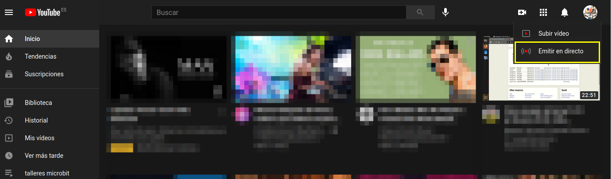
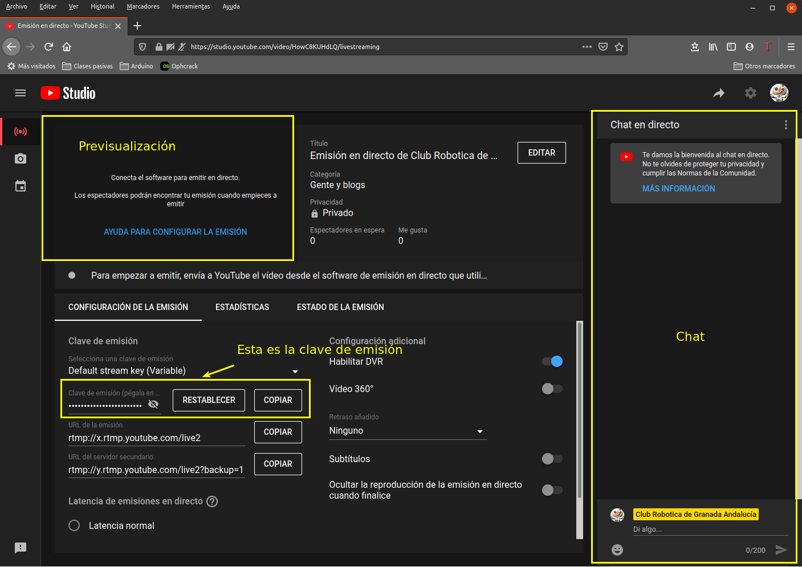
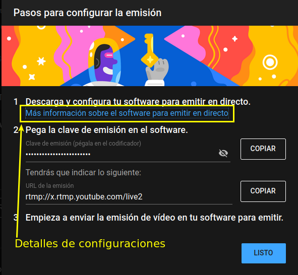
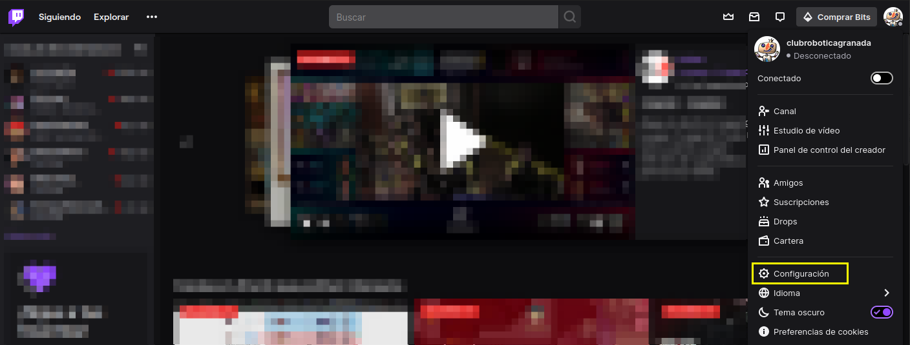
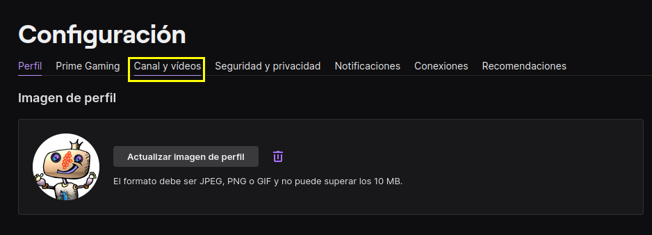
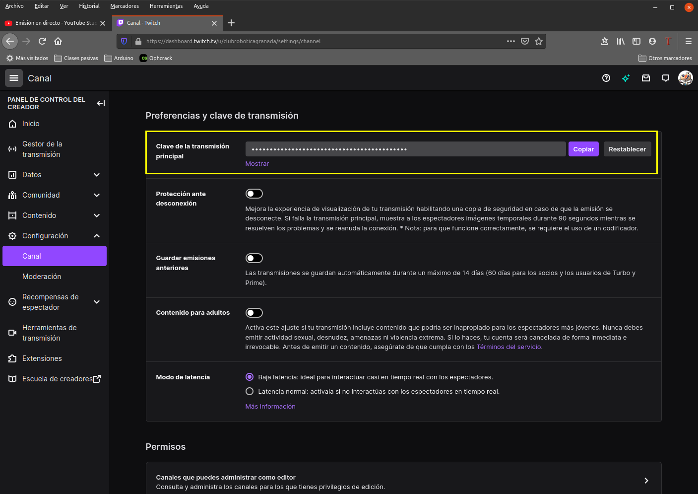

# Obtener clave de retransmisión

## Youtube
En este caso nos vamos a ir a la página de Youtube de la cuenta con la uqe vamos a emitir y vamos a hacer clic en "Emitir en directo", localizable en la parte superior derecha de la ventana, como vemos en la imagen 1.

| Imagen 1 |
|:-:|
|  |
| Acceso a Emitir en directo |

Esto nos dará acceso a una ventana como la que vemos en la imagen 2, que es la pantalla de emisión en directo de Youtube.

| Imagen 2 |
|:-:|
|  |
| Ventana Emitir en directo |

Copiamos la clave en el portapapeles (haciendo clic en el botón "COPIAR") y la pegamos en el lugar correspondiente en la configuración del perfil.

En la misma ventana de previsualización de la transmisión tenemos acceso a una "AYUDA PARA CONFIGURAR LA EMISION" que nos abre la ventana de la imagen 3. También tenemos acceso a las URLs de emisión para poder informar de donde se podrá ver la transmisión.

| Imagen 3 |
|:-:|
|  |
| Ventana de ayuda para configura la emisión |

## Twitch
En la imagen 4 vemos como acceder a la configuración de esta aplicación.

| Imagen 4 |
|:-:|
|  |
| Acceso a la configuración de Twitch |

Esta acción nos mostrará la ventana de la imagen 5, donde hacemos clic en la opción indicada.

| Imagen 5 |
|:-:|
|  |
| Ventana de configuraciones |

Se nos abre otra ventana con todas las opciones de configuración del canal y en la imagen 6 vemos donde obtener la clave de transmisión necesaria para el perfil.

| Imagen 6 |
|:-:|
|  |
| Localización de la clave de transmisión |

