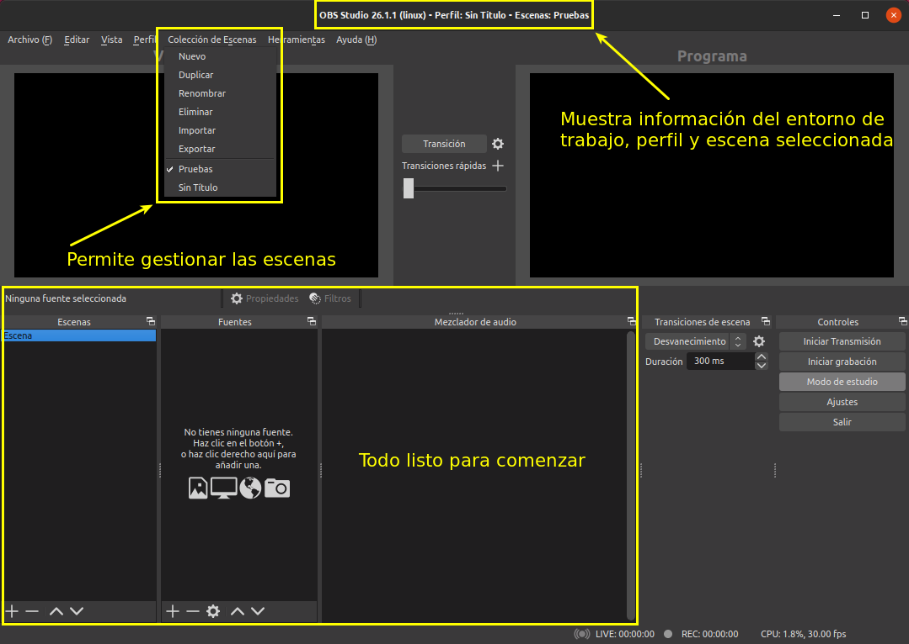
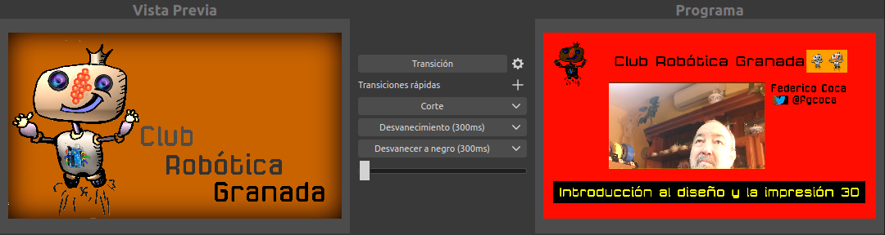
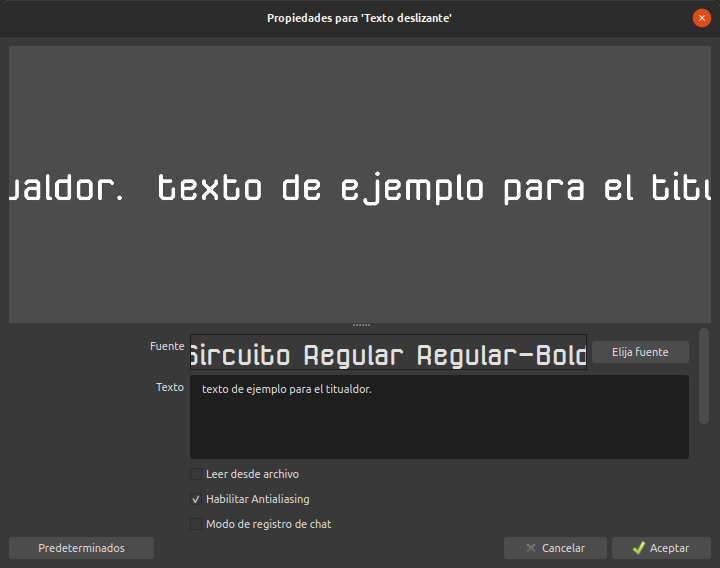
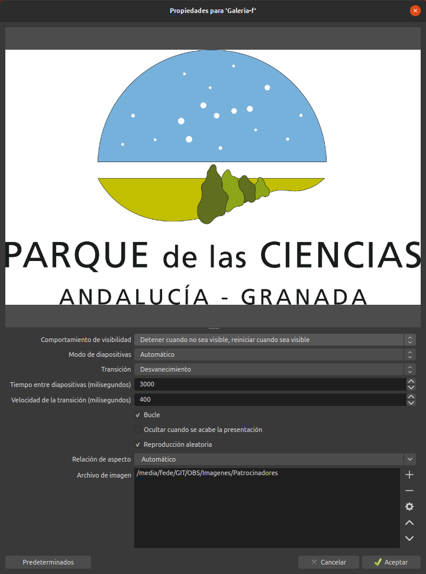

# Escenas
Antes de nada indicar que las imágenes las voy a crear a un tamaño de 1920x1080 píxeles con transparencia.

Indicar también que los vídeos que se enlazan son en realidad conversiones entre gif animados y mp4 realizadas con la plataforma [FFmpeg](https://ffmpeg.org/) que se puede instalar fácilmente en Ubuntu siguiendo, por ejemplo, estas instrucciones de como [Instalar FFmpeg en Ubuntu](https://www.hostinger.es/tutoriales/instalar-ffmpeg-linux/). En concreto el comando utilizado para la conversión es el siguiente:

`ffmpeg -i archivo.gif -movflags faststart -pix_fmt yuv420p -vf "scale=trunc(iw/2)*2:trunc(ih/2)*2" archivo.mp4`

Vamos a ver como crear y configurar distintas escenas para componer una producción de video para streaming o grabación. Las escenas se organizan por colecciones por lo que lo primero que vamos a hacer es ir a la entrada de menú para crear una nueva. Vemos el proceso en el video siguiente siguiente.

| Vídeo 1 |
|:-:|
| [Creación de una colección de escenas](https://youtu.be/jMbuyCWujwA) |

En la imagen 1 tenemos información relativa a esta entrada de menú. En el apartado [perfiles](../apartados/perfiles.md) tenemos la información relativa a creación y gestión de perfiles.

| Imagen 1 |
|:-:|
|  |
| La entrada de menú colección de escenas |

Cuando creamos una colección de escenas OBS nos crea un escena vacía por defecto. En el video 2 vemos el proceso para renombrar esta escena y añadir como fuente una webcam. Indicar que en  `Escenas` organizamos la información que vamos a utilizar para la realización y en `Fuentes` estarán los dispositivos y archivos multimedia que añadimos a las `Escenas`.

| Vídeo 2 |
|:-:|
| [Renombrar una escena y añadir una fuente](https://youtu.be/HkGX_5S0eUQ) |

Observamos también como hemos adaptado el tamaño de la fuente al tamaño del lienzo que OBS nos ha mostrado por defecto. La resolución la hemos establecido en ese valor por los motivos que se explican en [perfiles](../apartados/perfiles.md).

## Escena a partir de escena
En una producción para streaming es conveniente tener una escena `Principal` que en nuestro caso vamos a crearla, pero al añadir la fuente no vamos a añadir un medio, sino una escena. En escenas podemos establecer el orden mediante las flechas. En este caso la escena `Principal` y `Camara` son la misma pero según agreguemos otras escenas vamos a poner la escena `Camara` en todas las escenas de forma que si cambiamos de cámara o cambiamos los ajustes de la que tenemos se cambiarán en todas las escenas donde esté `Camara`, evitando así tener que ir escena por escena cambiando los ajustes. En el vídeo 3 vemos este proceso al completo.

| Vídeo 3 |
|:-:|
| [Crear escena siendo la fuente otra escena](https://youtu.be/5M0j5qQbIlI) |

## Escena a partir de imagen
En el vídeo 4 vemos el proceso para añadir y situar una imagen de fondo en nuestras escenas.

| Vídeo 4 |
|:-:|
| [Escena con imagen](https://youtu.be/JTSEh-PMlEc) |

Para hacer que la pantalla con fondo estático sea algo mas dinámica vamos a añadir un pequeño video que será indicador de que estamos emitiendo. Se trata de añadir una fuente multimedia que haremos que se repita en bucle dado que es de muy corta duración. En realidad lo que estamos añadiendo es un gif animado creado con GIMP a partir de tres imágenes estáticas que dimensionamos y situamos según nuestras preferencia. En el vídeo 5 vemos el proceso completo.

| Vídeo 5 |
|:-:|
| [Escena con imagen y fuente multimedia](https://youtu.be/nwE5vj4Ecos) |

## Escena con imagen y cámara
El siguiente paso que vamos a dar es veer como introducir una imagen de fondo con información relativa a lo que está mostrando la cámara en un marco transparente. Esto se utiliza como escena secundaria y en el vídeo 6 vemos el proceso de creación. Podemos observar como se adaptan en tamaño tanto el marco que contiene la imagen de fondo como la cámara añadida como escena al marco transparente.

| Vídeo 6 |
|:-:|
| [Escena con un marco](https://youtu.be/2DOVjR--NmM) |

En la imagen 2 podemos observar como se ha añadido la fuente multimedia con el gif animado a la escena con el marco.

| Imagen 2 |
|:-:|
|  |
| Escena con un marco y fuente multimedia |

## Titulador o ticker
Poner subtitulos a nuestra emisión es posible de forma sencilla creando la escena correspondiente y añadiendo a esta las fuentes adecuadas. Veamos como hacerlo:

1. Creamos la escena de la forma habitual y le ponemos el nombre que queramos.
   
2. Lo primero, como siempre, en nuestro flujo de trabajo (recomendado por [9decibelios](https://www.youtube.com/channel/UCpLlrD8_X6wGBX2mfWDjhEw)) es añadir como fuente la cámara, que es nuestra escena principal.

3. Ahora ya estamos preparados para añadir nuestro titulador y para ello añadimos la imagen que vamos a utilizar como base para el mismo. En este caso la imagen está creada con una resolución de 1920x1080 px, a partir de Inkscape y GIMP, con zonas transparentes para poder visualizar lo que nos interesa. Esta resolución es la misma que la del lienzo y de esta forma va a quedar ajustada al mismo. En el caso del titulador bloqueamos las fuentes que tenemos añadidas para que no se puedan mover accidentalmente. En el punto 4 continuamos con el trabajo para poner el subtitulo.

En el vídeo 7 vemos como se hace esta parte del proceso.

| Vídeo 7 |
|:-:|
| [Añadir fuentes cámara e imagen del titulador y bloquearlos](https://youtu.be/dxxh56ZMzD8) |

Podemos observar cuando aparecen las fuentes en la escena como quedan perfectamente ajustadas al lienzo escogido debido a que su resolución es la adecuada. También observamos que la zona rectangular con bordes redondeados donde aparecerá el subtitulo es transparente, lo cual hará en algunos casos poco legible el texto. Es mucho mejor ponerle un color sólido de fondo y escoger un color de fuente que tenga buen contraste con este. En este caso vamos a poner fondo negro y letras blancas.

4. Añadimos como fuente un origen de color que va a ser el fondo no transparente del título.

5. Ajustamos el fondo al tamaño del sticker con el manejador correspondiente (el central superior) mientras se mantiene pulsada la tecla alt, en el caso de linux. El tamaño debe ser parecido al del titulador (puede ser un poco mas pequeño) pero teniendo en cuenta que debe tapa la zona transparente del mismo.

6. Podemos observar que esta franja negra queda por encima de la imagen lo que hace que el titulador no sea visible. Debemos moverlo detrás de la imagen, lo que podemos hacer con las flechas o arrastrándolo con el ratón.

En el vídeo 8 vemos como llevar a cabo los puntos 4 al 6 anteriores.

| Vídeo 8 |
|:-:|
| [Añadir a las fuentes una banda de color](https://youtu.be/jqgR4a6KloQ) |

7. El siguiente paso va a ser colocar una fuente de texto a nuestro título. Para ello procedemos según vemos en el vídeo 9. Damos un nombre a la fuente, ponemos el texto que deseemos, escogemos fuente, reajustamos el tamaño y movemos para que aparezca de forma adecuada. Finalmente añadimos un filtro que va a consistir en que el texto se desplace en lazo por nuestra barra de título. Es importante poner al final del texto dos o tres espacios para que no se unan el principio y el final.

| Vídeo 9 |
|:-:|
| [Poner texto deslizante al titulador](https://youtu.be/ZiBQ3AvYsFk) |

En la ventana que vemos en la imagen 3 escribimos el texto que queremos que aparezca en el titulador, elegimos la fuente y le damos un tamaño mas o menos adecuado al que debe tener para que se vea correctamente en la zona transparente de nuestra imagen. En este caso la fuente escogida para el ejemplo es la [TTF-Sircuito](https://github.com/fgcoca/TTF-Sircuito) que es una True Type Font creada por Victor Ventura para Granabot y que también utiliza [Club Robótica Granada](https://clubroboticagranada.github.io/).

| Imagen 3 |
|:-:|
|  |
| Ventana de propiedades del texto |

Con esto ya tenemos nuestro primer ticker finalizado.

## Información cambiante
Vamos a añadir otra escena a nuestra producción de ejemplo en este caso utilizando la galería de imágenes como fuente con el fin de dar información relativa al evento que estemos transmitiendo. Ahora la pantalla va a quedar dividida de forma vertical con una zona donde se muestre la cámara y otra donde se muestre la galería de imágenes que queramos.

El proceso a seguir es agregar una nueva escena y añadirle a esta una primera fuente que es la cámara, una segunda que es la imagen y finalmente añadimos la galería de imágenes. En el vídeo 10 vemos el proceso.

| Vídeo 10 |
|:-:|
| [Escena con información cambiante](https://youtu.be/hmWXOECxjjg) |

En la imagen 4 vemos la ventana de propiedades de la galería de imágenes.

| Imagen 4 |
|:-:|
|  |
| Ventana de propiedades de la galería de imágenes |

Las diferentes opciones son bastante evidentes en su funcionamiento con el título que tienen y no me voy a detener demasiado en describirlas. Si diré que el tiempo entre diapositivas debemos fijarlo de forma que no sea muy lento pero que de tiempo a ver lo que se propone, entre 3 y 5 segundos suele estar bien. También indicar que los archivos de imagen pueden ser seleccionado de manera individual o como en este caso escogiendo un directorio. En la parte superior de la ventana vamos observando como afectan las configuraciones que escogemos a la galería.

## Compartir pantalla
Voy a explicar brevemente dos formas de hacerlo, la primera simplemente mostrará la pantalla del monitor seleccionado y la segunda además incluirá una imagen junto con un espacio para ver en pequeño a la persona que está hablando.

### Captura de pantalla
Procedemos a añadir una nueva escena y como fuente seleccionamos captura de pantalla. Procedemos como se observa en el vídeo 11 y a partir de este momento en nuestra nueva escena se verá la pantalla compartida, que lógicamente podemos pasar al programa cuando deseemos.

| Vídeo 11 |
|:-:|
| [Escena captura de pantalla](https://youtu.be/gs7bJ6R_ofM) |

Evidentemente podemos retocar la ventana que se comparte utilizando los manejadores y la tecla alt, tal y como hemos hecho en otras ocasiones. Esto nos permitirá, por ejemplo, crear espacio para añadir otras otras fuentes como la cámara.

### Captura de ventana
En realidad en este apartado lo que vamos a hacer es justamente lo descrito en el párrafo anterior, o sea, redimensionar la ventana al espacio destinado a tal fin e incluir la pantalla en la escena. Vemos el procedimiento en el video 12.

| Vídeo 12 |
|:-:|
| [Escena captura de pantalla con cámara](https://youtu.be/0wYujJ3fvPM) |

## Ejemplo de uso de escenas
En el video 13 tenemos un ejemplo de posible utilización de las escenas montadas en esta sección.

| Vídeo 13 |
|:-:|
| [Vídeo de ejemplo de uso de escenas]([../img/escenas/Video-ejemplo-edicion-programa.mp4](https://youtu.be/UVjqSZwxbjI)) |

