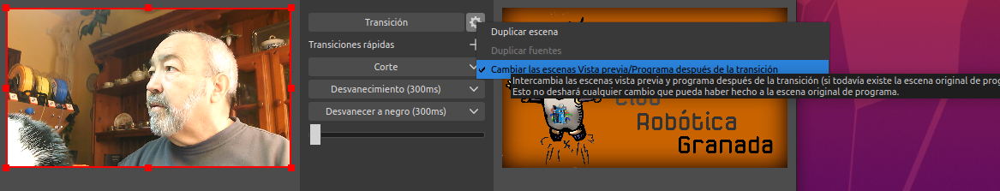
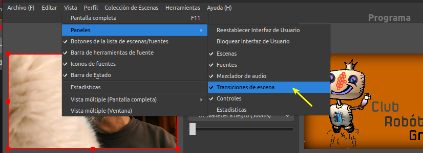

# El IDE de OBS
La primera vez que abrimos el programa el IDE presenta el aspecto de la imagen 1. Observamos como el área de trabajo está dividida en dos partes principales:

* Parte superior, muestra una ventana que es donde se verá lo que estemos grabando o emitiendo en directo.

* Parte inferior, donde se encuentran todas las ventanas de controles que nos permiten hacer la realización.

| Imagen 1 |
|:-:|
|  |
| Aspecto inicial del IDE de OBS |

## Modo de estudio
Si activamos este modo desde la ventana de controles observamos (Imagen 2) como el área de trabajo queda dividida en dos partes separadas por un conjunto de botones que se denomina área de transiciones.

| Imagen 2 |
|:-:|
|  |
| Aspecto inicial del IDE de OBS en *Modo de estudio* |

En la animación 1 se han cargado dos escenas para demostrar el uso básico de este modo, una es una imagen fija y la otra corresponde a la entrada de la webcam.

| Animación 1 |
|:-:|
|  |
| Manejo básico de las transiciones |

Vamos a describir un poco el funcionamiento de este modo, y para ello vamos a utilizar las dos escenas que hemos usado anteriormente en las transiciones. En la imagen 3 tenemos una posible situación de estado en la que vemos a la izquierda previsualizada la webcam y a la derecha una imagen fija. En esta situación esta imagen será lo primero que se vea al iniciar una transmisión en directo o grabación.

| Imagen 3 |
|:-:|
|  |
| Estado de escenas para previsualización y emisión |

Estas dos pantallas son las que nos permiten tener a la vista lo que estamos emitiendo y lo siguiente que entrará y así poder llevar a cabo una realización exitosa. Si por ejemplo hacemos una transición por corte (suele ser el tipo mas utilizado) la situación cambiaría a la que vemos en la imagen 4 y ahora se estaría emitiendo la webcam y en previsualización estaría la imagen.

| Imagen 4 |
|:-:|
|  |
| Estado de escenas para previsualización y emisión |

El programa lo que hace al pulsar en transición es intercambiar los modos entre las dos últimas escenas utilizadas. En el apartado [Escenas](../apartados/escenas.md) se describen estas con mas detalle. Si añadimos mas escenas en el apartado correspondiente podremos ir creando nuestro programa para emisión o grabación. Para elegir que escena previsualizar hacemos clic en la que queramos en el apartado escenas. En la imagen 5 vemos el resultado después de hacer clic en la escena Inicio-fin partiendo de la situación que tenemos en la imagen 3, donde vemos que se está emitiendo y previsualizando la imagen fija.

| Imagen 5 |
|:-:|
|  |
| Estado de escenas para previsualización y emisión |

Las ventanas escenas y fuentes son las mas importantes de OBS ya que con ellas se lleva a cabo toda la realización. La ventana de escenas nos permite configurar lo que queremos emitir y la ventana de fuentes nos muestra los dispositivos y archivos multimedia para mostrar.

## Mezclador de audio
En esta ventana se nos muestra un sencillo pero a la vez útil e intuitivo mezclador de audio. Si accedemos a los ajuste de audio (Imagen 6) podemos ver las opciones de configuración y dispositivos que podemos habilitar y que explicamos brevemente.

| Imagen 6 |
|:-:|
|  |
| Opciones de configuración de audio: frecuencia de muestreo |

### Configuraciones

1. **Frecuencia de muestreo**. Nos permite escoger entre 48 kHz, que sería una frecuencia de máxima calidad para posterior edición, y 44.1 kHz que sería una frecuencia normal. Se recomienda 44.1 para cámaras no profesionales Si es conveniente que a todas las fuentes de audio les asignemos la misma frecuencia de muestreo.

2. **Canales**. En la imagen 7 vemos los canales que podemos configurar y su significado que se ha obtenido de la entrada [Audio multicanal](https://es.wikipedia.org/wiki/Audio_multicanal#:~:text=As%C3%AD%2C%201.0%20corresponde%20al%20sonido,canales%20(2.1%20o%203.0).) de la Wikipedia.

| Imagen 7 | Significado |
|:-:|---|
|  |   Mono. Canal de audio monoaural     Estéreo. Canal de audio estéreo    2.1. 2 canales (estéreo) con un canal para efectos de baja frecuencia    4.0. Sonido cuadrafónico con dos canales frontales y dos traseros   4.1. Sonido cuadrafónico con tres canales frontales y uno trasero   5.1. Tres canales frontales mas dos traseros   7.1. Tres canales frontales, dos laterales y dos traseros  |
| Opciones de configuración de audio: canales ||

3. **Dispositivos de audio globales**. Nos permite seleccionar las distintas fuente de entrada de audio de las que dispongamos, como micrófonos internos y microfónos auxiliares o dispositivos conectados a las tomas jack. Se recomienda escoger *por defecto* para que la configuración de dispositivos sea heredada del sistema operativo.

4. **Medidores**. El *decaimiento* se refiere al tiempo que mostrará el pico de audio en los medidores. En los *tipos de medidor de pico* es la forma en la que se mostrará el pico de audio. La opción *True peak* es la ideal teniendo en cuenta que utiliza mas recursos de la CPU.

5. **Avanzado**. Nos permite elegir el dispositivo por donde escuchar las fuentes de audio. Se puede dejar la opción por defecto si no se producen loops de audio o bien escoger la monitorización interna.

En la imagen 8 vemos las partes en las que se divide cada entrada del mezclador y su significado o descripción.

| Imagen 8 | Significado |
|:-:|---|
|  |   a-volumen. Barras de colores indicadoras del volumen de ese canal     b-fader. Control deslizante de volumen    c-silencio. Botón que permite silenciar el canal.    d-opciones. Opciones adicionales de configuración de la fuente   e-nivel de volumen. El valor de ajuste del fader expresado en decibelios  |
| Visulización canales de audio ||

En las opciones adicionales de configuración (rueda dentada) tenemos otras opciones de configuración avanzadas que son:

- **Bloquear volumen**. Cuando tengamos configurado el nivel deseado de volumen podemos bloquear el fader para evitar cambiarlo accidentalmente.

- **Mostrar todos, ocultar y renombrar**. Opciones para mostrar todos los canales de audio, ocultar alguno concreto o cambiar el nombre de los mismos.

- **Copiar filtros y pegar filtros**. Permite copiar y pegar una configuración determinada de filtros.

- **Interfaz vertical**. Pone los controles del visualizados de audio en disposición vertical.

- **Filtros**. Nos da el control sobre elementos de filtrado de audio como puertas, compresores, expansores, eliminación de ruido, etc.

### Zonas del medidor de volumen
El medidor de volumen se divide (imagen 8) en tres zonas representadas en verde, amarillo y rojo.

* **Zona verde**. Es la zona ideal donde deben permanecer todos los niveles.

* **Zona amarilla**. Esta zona queda destinada al habla y es donde debe de permanecer el volumen sin entrar en la zona roja.

* **Zona roja**. Debe evitarse pues el sonido está distorsionado.

Lo ideal siempre es ajustar y bloquear el nivel de volumen entre las zonas verde y amarilla.

### Canales
A cada fuente de audio se asigna al menos un medidor de volumen. En la imagen 9 observamos los canales asignados a dos dispositivos y se observa perfectamente como uno es estéreo y el otro mono.

| Imagen 9 |
|:-:|
|  |
| Canales de audio |

En la animación 2 vemos los indicadores en funcionamiento y a continuación se explica el significado de sus partes.

| Animación 2 |
|:-:|
|  |
| Indicadores de audio en funcionamiento |

A continuación vemos las distintas partes de estos indicadores.

* A la izquierda podemos ver el indicador de nivel de entrada mediante un punto estático indicando el nivel de volumen del directo en verde, rojo o amarillo.

* Vemos unos puntos negros (siempre en movimiento) que se corresponden con el Vu-meter, o sea que indican la ‘presión del sonido’.

* La línea principal (siempre en movimiento) es el medidor de programa de picos

* El punto derecho (a veces estático)indica el pico y muestra lo más alto que ha subido el medidor, y es una excelente manera de ver si se está recortando la salida.

## Algunos detalles técnicos

### dBFS
Los niveles de audio se miden en decibelios (dB), que es una escala logarítmica que se adapta muy bien a la forma en que nuestros oídos perciben el volumen de audio.

Pero dB es una medida relativa y podemos establecer el valor 0 dB en cualquier lugar del medidor. En audio digital, la convención es usar 0 dBFS (el sufijo FS se usa justamente para indicar esta convención) como el volumen máximo que la tarjeta de sonido, la interfaz de audio y el convertidor DA/AD pueden manejar. Los niveles de volumen más bajos se muestran siempre con valores dBFS negativos.

### PPM (Peak Programme Meter)
El PPM es la característica visual principal del medidor OBS y se ilumina como parte del medidor de volumen general.

El medidor se divide en tres secciones de colores diferentes. A -20 dBFS tenemos el nivel de alineación y a -9 dBFS tenemos el nivel máximo permitido.

### Nivel de entrada
El nivel de entrada es el indicador cuadrado pequeño en el extremo izquierdo del medidor. Este es el mejor lugar para ver si el audio es demasiado alto para la interfaz de audio que captura su micrófono.

Los colores se corresponden a los siguientes valores:

* Verde oscuro. Inferior a -50 dBFS

* Verde claro. Entre -50 y -20 dBFS

* Amarillo. Entre -20 y -9 dBFS

* Rojo. Entre -9 dBFS y -0,5 dBFS
  
* Blanco. Superior a -0,5 dBFS

## Transiciones
En esta sección es donde tenemos todas las opciones para configurar la forma en la que se hacen las transiciones entre escenas. Tenemos dos lugares en los que aparece, la zona central entre escenas y en la ventana junto al mezclador de audio. En primer lugar vamos a explicar brevemente los tipos mas comunes de transiciones.

### Transiciones usuales
* **Corte**. Esta es la forma mas habitual y recomendada de realizar transiciones entre escenas cambiando rápidamente las escenas entre la pantalla de edición y la de directo.
* **Desvanecimiento**. Se utiliza principalmente cuando hay cambios muy significativos como un cambio de tema o cambio de narrador y se puede configurar el tiempo que dura que por defecto está a 300 ms, no siendo recomendable aumentar este tiempo mas allá de los 400 o 500 ms.
* **Desvanecer a negro**. Simplemente realiza un fundido a negro y se usa normalmente cuando se hacen pausas o se finaliza la emisión.
* **Mando deslizante**. Este mando nos permite controlar el desvanecimiento de la escena en la transición.

Para realizar transiciones hay que tener seleccionada la escena futura en el panel Escenas de forma que aparezca en la ventana de edición del modo estudio. Si en la ventana directo aparece la misma escena que en la de edición la transición no hará nada.

En la animación 3 vemos en funcionamiento estas transiciones.

Estas son las escenas por defecto, y en estas condiciones en la ventana Transición de escena la rueda dentada no estará operativa dado que OBS no permite su eliminación.

| Animación 3 |
|:-:|
|  |
| Transiciones usuales |

Los cambios que se producen entre las dos ventanas se hacen de la forma que se ve debido a la configuración establecida, que podemos observar en la imagen 10 y a la que se accede haciendo clic sobre la rueda dentada a la derecha del botón Transición.

| Imagen 10 |
|:-:|
|  |
| Configuración del comportamiento del botón Transición |

### Transiciones de escena
Se trata de la ventana que aparece a la derecha del Mezclador de audio donde podemos configurar las transiciones. Si no está visible debemos ir a la ruta indicada en la imagen 11 y activarla.

| Imagen 11 |
|:-:|
|  |
| Configuración de la visibilidad de los paneles |

En la imagen 12 podemos ver las opciones que tenemos disponibles cuando pulsamos en el desplegable a la izquierda de la rueda dentada.

| Imagen 12 |
|:-:|
|  |
| Opciones de transición de escena disponibles |

Ahí es donde podemos añadir transiciones y se nos muestran las instaladas por defecto. Haciendo clic sobre cualquiera de las que están precedidas por Agregar podremos establecer sus propiedades y añadirla a nuestro grupo de transiciones rápidas mediante el botón +.

* **Deslizar**. Desliza la pantalla en el sentido seleccionado y el tiempo establecido en Duración.
* **Diapositiva**. Muy similar a Deslizar pero sin la opción Deslizar hacía adentro.
* **Stinger**. Aquí es donde podemos poner nuestras transiciones personalizadas. En el [enlace](https://obstutoriales.es/las-7-mejores-transiciones-para-obs-studio/) dispones de información sobre el tema ¡.
* **Desvanecer color**. Se trata de un destello en la transición realizado con el color seleccionado.
* **Luma Wipe**. Mas que una transición se trata de una colección configurable de estas y es donde mas opciones tenemos.

Para añadir la transición de escena Deslizar hacemos clic en el lugar indicado en la imagen 13a y en el desplegable elegimos la opción que vemos en la imagen 13b.

| Imagen 13a | Imagen 13b |
|:-:|:-:|
|  |  |
| Acceso a tipos de transición de escena disponibles | Elección de transición de escena disponibles |

Nos aparecerá una ventana donde poner nombre a la transición como vemos en la imagen 14.

| Imagen 14 |
|:-:|
|  |
| Ventana para poner nombre a la transición |

En la animación 4 vemos el proceso completo donde se añaden varias transiciones y también como se elimina una de ellas.

| Animación 4 |
|:-:|
|  |
| Añadir y eliminar transiciones de escena |

Estas dos transiciones ya están disponibles para añadirlas a las transiciones rápidas siguiendo el proceso que vemos en la animación 5, donde además las vemos en funcionamiento.

| Animación 5 |
|:-:|
|  |
| Añadir transiciones de escena a transiciones rápidas |

### Mas transiciones
Existen páginas donde descargar transiciones para OBS de forma gratuita, también las hay de pago y finalmente podemos incluso crear nuestras propias transiciones, aunque no son precisamente fáciles de crear.

Tenemos la opción de descargar las escenas de transición de Internet, donde existen paquetes gratuitos que se pueden utilizar sin problema, dos de los cuales son:

* [Nedordie](https://nerdordie.com/)
* [Visuals by impulse](https://visualsbyimpulse.com/store/10-free-stinger-transitions)

Una vez descargado el paquete podemos agregar las que nos interesen escogiendo la opción Stinger y localizando el archivo de la misma. En la animación 6 vemos en funcionamiento dos de estas transiciones del paquete de Visuals by impulse.

| Animación 6 |
|:-:|
|  |
| Transiciones de escena Stinger |

