# Instalación de Jack Mixer
Vamos a realizar la instalación a través de los paquetes debian que encontramos en este [enlace](https://packages.debian.org/stable/jack-mixer), para ello comenzamos por descargar la versión que se adapte a nuestro sistema, en mi caso arquitectura amd64. Esto lo encontramos en el enlacen anterior bajando por la página hasta que veamos algo similar a la imagen 1.

| Imagen 1 |
|:-:|
| 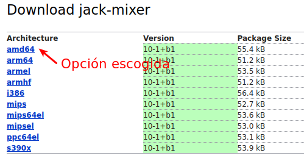 |
| Opciones de descarga disponibles |

Se nos mostrará una lista de servidores desde donde proceder a la descarga. En mi caso elijo uno de Europa.

Hemos podido observar que en la página inicial se da un listado de paquetes relacionados con jack mixer, marcados en rojo están las dependencias, en azul las recomendaciones y en verde las sugerencias, tal y como vemos en la imagen 2.

| Imagen 2 |
|:-:|
| 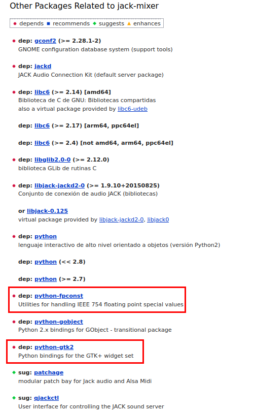 |
| Paquetes relacionados con jack mixer |

Una vez realizadas las descargas indicadas debemos tener, como vemos en la imagen 3, los tres archivos necesarios para proceder con las instalaciones. Se indica además el orden de instalación que debemos seguir para que se instalen los paquetes y todas las dependencias necesarias.

| Imagen 3 |
|:-:|
| 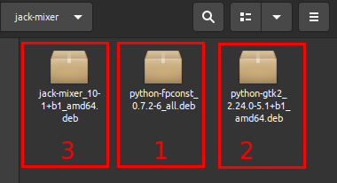 |
| Archivos necesarios para instalar |

El método que voy a seguir para instalar es a partir de una terminal utilizando `GDebi`, pero también se podría lanzar en modo gráfico tal y como vemos en la imagen 4. De las dos formas vamos a llegar a la ventana gráfica de GDebi que vemos en la imagen 5b.

| Imagen 4 |
|:-:|
| 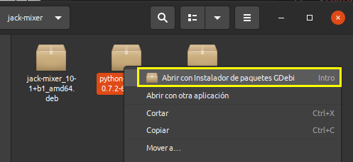 |
| Lanzar GDebi en modo gráfico |

En mi caso y para mas claridad he situado los tres archivos en un directorio concreto.

Si procedemos como vemos en la imagen 5a (o en la imagen 4) se nos abrirá la ventana que vemos en la imagen 5b.

| Imagen 5a | Imagen 5b |
|:-:|:-:|
| 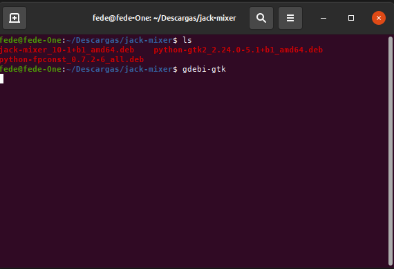 |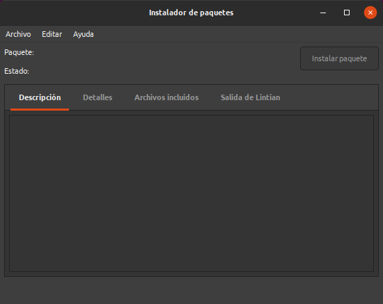 |
| Lanzamos GDebi desde la terminal | Ventana gráfica de GDebi |

Desde el menú archivo procedemos a abrir el primer archivo ("python-fpconst_0.7.2-6_all.deb") y se nos mostrará algo similar a lo que vemos en la imagen 6. Si son necesarias algunas dependencias nos informará de ello y por tanto debemos tener conexión a internet para que estas se descarguen de los repositorios oficiales de Ubuntu.

| Imagen 6 |
|:-:|
| 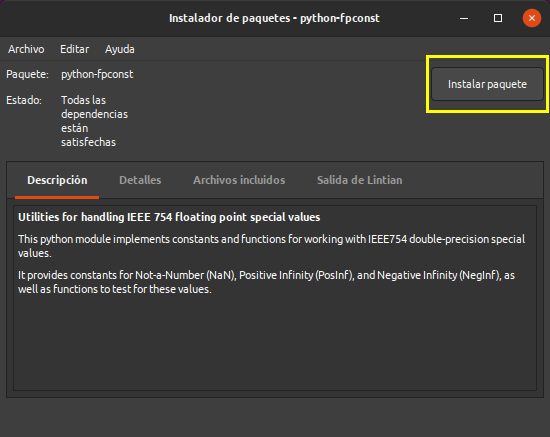 |
| Paquete python-fpconst listo para instalar |

Es posible que se nos solicite contraseña de superusuario para llevar a cabo la tarea. Transcurridos unos instantes se muestra lo que vemos en la imagen 7 que no indica que el proceso ha finalizado.

| Imagen 7 |
|:-:|
| 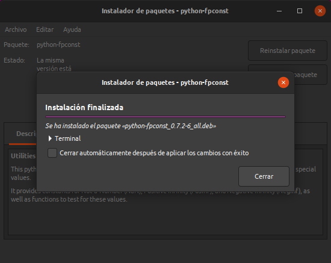 |
| Paquete python-fpconst instalado |

Procedemos a cerrar ambas ventanas para recuperar el usuario, ya que en este momento somos `root`.

Abrimos de nuevo GDebi y vamos a instalar el archivo "python-gtk2_2.24.0-5.1+b1_amd64.deb" tal y como vemos en la imagen 8. En este caso se requieren otros dos paquetes. En la imagen 8 vemos el resultado de la instalación.

| Imagen 8 |
|:-:|
| 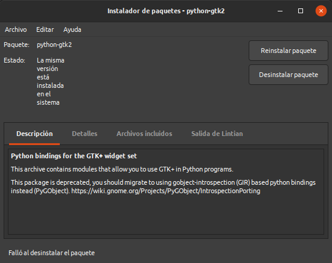 |
| Paquete python-gtk2 instalado |

Cuando finalice la instalación volvemos a cerrar las ventanas abiertas y procedemos a instalar el programa jack mixer. En este caso se requiere la instalación de otros diez paquetes adicionales, tal y como se observa en la imagen 9.

| Imagen 9 |
|:-:|
| 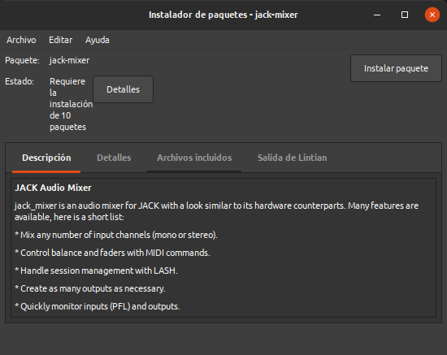 |
| Paquete jack-mixer_10-1+b1_amd64 listo para instalar |

En algún momento se va a mostrar la ventana de la imagen 10, donde debemos seleccionar la opción para poder ejecutar a posteriori jack con prioridades en tiempo real.

| Imagen 10 |
|:-:|
| 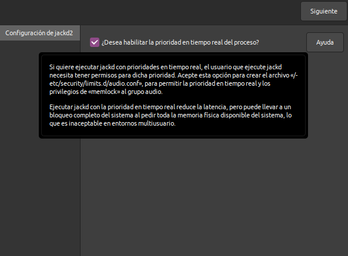 |
| Selección de prioridades en tiempo real |

Una vez finalizada la instalación se muestra la imagen 11 con la información del paquete instalado.

| Imagen 11 |
|:-:|
| 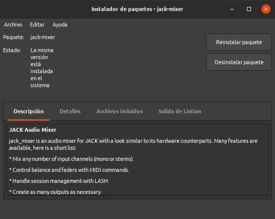 |
| Paquete jack-mixer_10-1+b1_amd64 instalado |

Ya podemos localizar el programa entre nuestras aplicaciones, tal y como se muestra en la imagen 12.

| Imagen 12 |
|:-:|
| 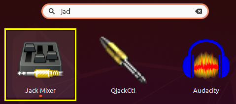 |
| Accesp a Jack Mixer |

La primera vez que ejecutamos el programa tendrá el aspecto de la imagen 13 dado que no tenemos configuradas ni entradas ni salidas.

| Imagen 13 |
|:-:|
| 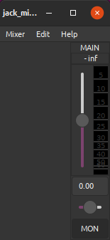 |
| Programa Jack Mixer |

En la imagen 12 observamos también que está disponible QjackCtl, que es una herramienta gráfica para controlar Jack. Tiene como funciones básicas:

* Detectar automáticamente el hardware audio

* Permite al usuario elegir subdispositivos para entradas y salidas desde una lista drop-down

* Incluye opciones comunes para el servidor de sonido.

En la imagen 14a podemos ver el aspecto de QjackCtl gestionando Jack y en la 14b un ejemplo de conexiones.

| Imagen 14a | Imagen 14b |
|:-:|:-:|
| 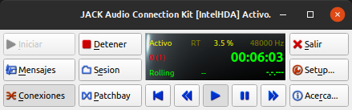 | 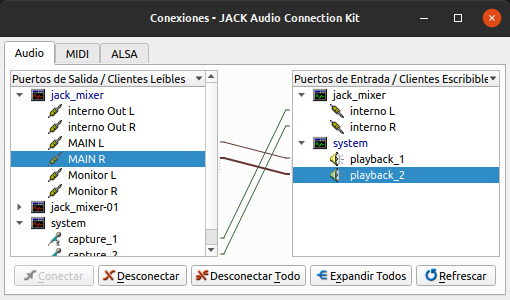 |
|QjackCtl gestionando Jack | Conexiones QjackCtl |

