# OBS.Ninja
Cuando entramos en [OBS.Ninja](https://obs.ninja/) se nos muestra la pantalla que vemos en la imagen 1.

| Imagen 1 |
|:-:|
| 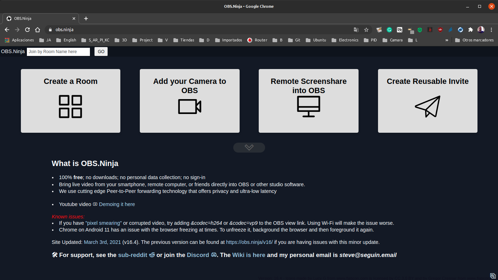 |
| Aspecto de la pantalla principal de OBS.Ninja |

Pero antes de entrar en detalles sobre lo que se puede hacer diremos que OBS.Ninja es un programa web gratuito y de código abierto diseñado para llevar video en directo desde una fuente externa (teléfono inteligente, tablet u ordenador) a OBS Studio.

[OBS.Ninja](https://obs.ninja/) depende de **webRTC**, una tecnología de transmisión segura entre iguales o punto a punto de la que disponen la mayoría de los navegadores. La mayor parte del código de OBS.Ninja se ejecuta completamente dentro de nuestro navegador, lo que permite una baja latencia y alta calidad de video.

Básicamente, hay dos URLs, una de entrada y una de salida. La URL de entrada se carga en el dispositivo remoto, que obtiene el permiso del usuario para usar la cámara y el micrófono del dispositivo. El resultado de esto es otra URL, que se puede utilizar para acceder a la transmisión de forma remota. Esa URL también se puede colocar directamente en una escena de OBS como un elemento de origen del navegador. El video se reproducirá automáticamente una vez que se agregue la URL a OBS.

Los usos mas comunes de OBS.ninja son:

* Utilizar un dispositivo móvil como una cámara remota inalámbrica.
* Incorporar video y audio de otras personas para a nuestro directo.
* Compartir audio y video de alta calidad y baja latencia a través de Internet y en redes locales.
* Transmitir juegos de forma remota, por ejejmplo de un amigo a nuestro OBS para jugar juntos.
* Publicar en YouTube con nuestro teléfono inteligente.
* Ver películas con amigos.
* Para usar como alimentación remota de teleprompter de baja latencia
* Cualquier otra razón que se nos ocurra.

El creador de OBS.Ninja, Steve Seguin, ha elaborado un video explicativo de cómo agregar cámaras remotas a OBS Studio, que podemos ver en el enlace del video 1. Aunque el video está en inglés creo que es posible seguirlo dado que las herramientas son muy sencillas de usar.

| Video 1 |
|:-:|
| [Video de Steve Seguin sobre el uso de OBS.Ninja](https://www.youtube.com/watch?v=6R_sQKxFAhg&t=11s) |

El entorno de OBS.Ninja es posible cambiarlo de idioma y en la animación 1 vemos como ponerlo en español.

| Animación 1 |
|:-:|
| 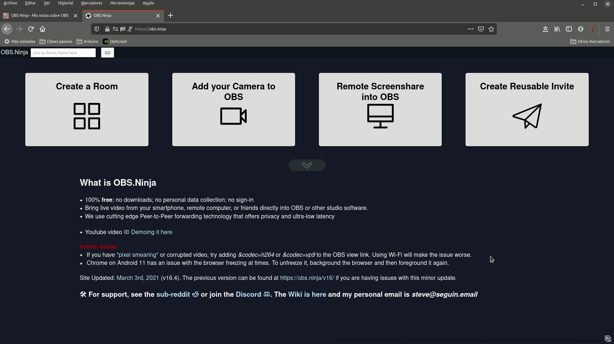 |
| Estableciendo idioma español en OBS.Ninja |

## Agregar cámara remota a OBS con OBS.Ninja
En realidad lo que vamos a hacer es agregar una cámara que está en otro equipo y en otro lugar a OBS a través de OBS.Ninja que se encargará de detectar la configuración de video y audio automáticamente. También podemos agregar una ventana compartida de la misma forma. OBS:ninja nos muestra al inicio los cuatro botones que vemos en la imagen 2, y vamos a ver el uso de cada uno de ellos.

| Imagen 2 |
|:-:|
| 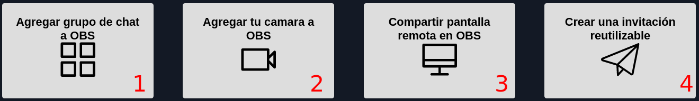 |
| Botones en la pantalla principal de OBS.Ninja |

### Botón 1: Agregar grupo de chat a OBS
Cuando pulsamos este botón se nos abre una nueva ventana como la que vemos en la imagen 3, donde debemos poner nombre a la sala, podemos establecer una contraseña, que debemos suministrar a nuestro invitado, marcar las opciones seleccionadas y elegir el Codec de video. Este botón lo utilizaremos para poner OBS.Ninja en OBS para un grupo de personas.

| Imagen 3 |
|:-:|
| 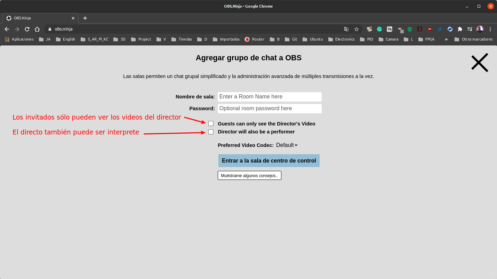 |
| Configuración de Agregar grupo a chat de OBS |

Si marcamos la primera opción lo que estamos haciendo es que los invitados no puedan ver a otros invitados y si marcamos la segunda hacemos que el director también sea el interprete. Por defecto se suelen dejar sin marcar. Si nos interesa podemos establecer un Codec de video concreto de entre los disponibles y/o mostrar algunos consejos, tal y como vemos en la Animación 2, donde también se observa el uso del botón situado arriba a la derecha.

| Animación 2 |
|:-:|
| 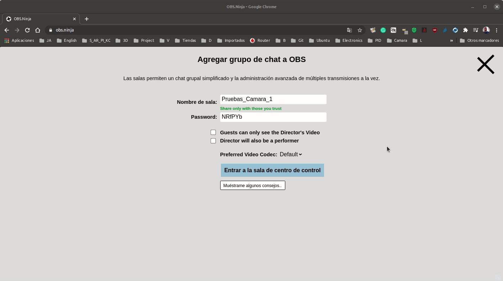 |
| Configuración de una sala |

Al pulsar el botón de entrar a la sala de centro de control se nos muestra lo que vemos en la imagen 4, lo que es el centro de control para la sala creada.

| Imagen 4 |
|:-:|
| 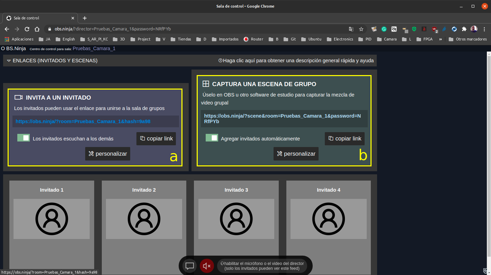 |
| Sala de centro de control |

El recuadro a nos muestra el enlace que debemos facilitar a nuestro invitado o invitados a la sala creada (debemos recordar facilitarles también la contraseña, si es que hemos establecido alguna) y en el recuadro b tenemos el enlace que debemos poner en la fuente de OBS para poder acceder a alguno de los elementos que nos va a mostrar el invitado al que hemos facilitado el enlace del recuadro a.

En la animación 3 podemos ver como interactuar con los apartados de la ventana simplemente con el propósito de mostrar las distintas opciones disponibles ya que no entraremos en mas detalles.

| Animación 3 |
|:-:|
|  |
| Interactuando con el centro de control de la sala |

En el video 2 se explica como poner en OBS una cámara remota y una pantalla compartida. Aunque en el vídeo utilizo mi propia webcam y una pantalla de mi escritorio estas se ven en OBS a través de un navegador, que es quien las está emitiendo, razón por la que esas fuentes pueden perfectamente estar en otro equipo y en otro lugar.

| Video 2 |
|:-:|
| [cámara y pantalla remotas en OBS a través de OBS.Ninja](https://youtu.be/YkxS6_TjvMM) |

### Botón 2: Agregar tu cámara a OBS
Este segundo botón nos permite agregar nuestras fuentes de video a través de un navegador, es decir transmitir, por ejemplo, una webcam via web a un navegador. En el video 3 podemos ver como configurar y trabajar con este botón. Este botón lo utilizaremos para poner OBS.Ninja en OBS para una sola persona.

| Video 3 |
|:-:|
| [Agregar nuestra cámara a OBS a través de OBS.Ninja](https://youtu.be/nTBM9VheZ58) |

Es muy importante recordar que para que se capture la cámara remota es imprescindible que la ventana de OBS.Ninja que nos suministra el enlace permanezca abierta, aunque esté minimizada.

### Botón 3: Compartir pantalla remota en OBS
Si queremos compartir el escritorio utilizaremos este tercer botón abriendo una pestaña, o ventana, diferente en nuestro navegador con OBS.Ninja. Es decir, si queremos compartir la cámara lo hacemos en una pestaña y si también queremos compartir el escritorio lo hacemos en otra pestaña. Este botón lo utilizaremos para poner OBS.Ninja en OBS para una sola persona.

El procedimiento es totalmente similar al del botón 2 simplemente seleccionando la ventana que deseamos compartir.

### Botón 4: Crear una invitación reutilizable
Para ver el uso de este botón vamos a usar nuestro móvil como cámara. Si pulsamos el botón se nos va a mostrar lo que vemos en la imagen 5.

| Imagen 5 |
|:-:|
| 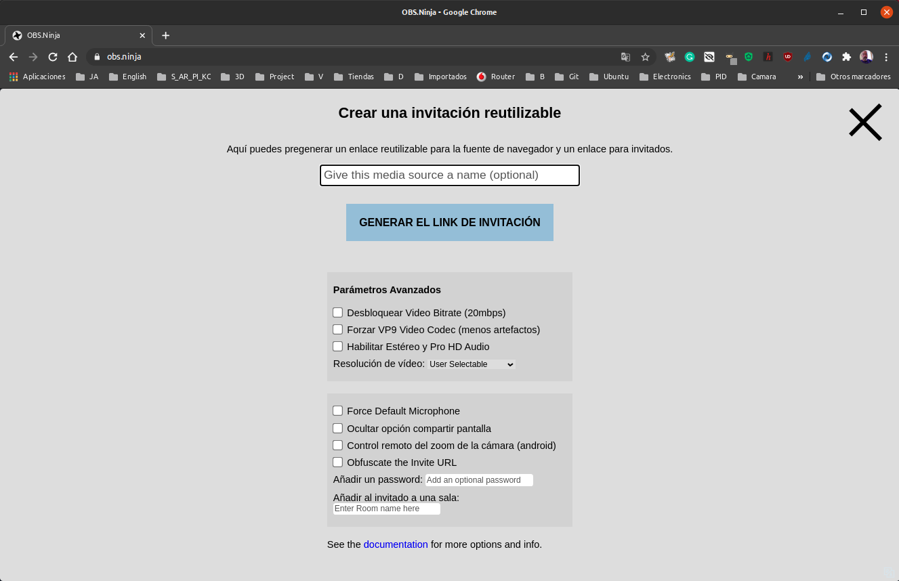 |
| Pantalla principal de creación de invitación reutilizable |

Si disponemos de una muy buena conexión a internet podemos habilitar las opciones Unlock video bitrate (20mbps); Enable Stereo and Pro HD Audio y Maximun Resolution en Video Resolution.

Cuando pulsamos en **Generar link de invitación** se nos mostrará algo similar a lo que vemos en la imagen 6. El texto que aparece en la parte inferior traducido es: *Este enlace de invitación y el enlace de transferencia de OBS son reutilizables. Solo una persona puede usar una invitación específica a la vez.*

| Imagen 6 |
|:-:|
| 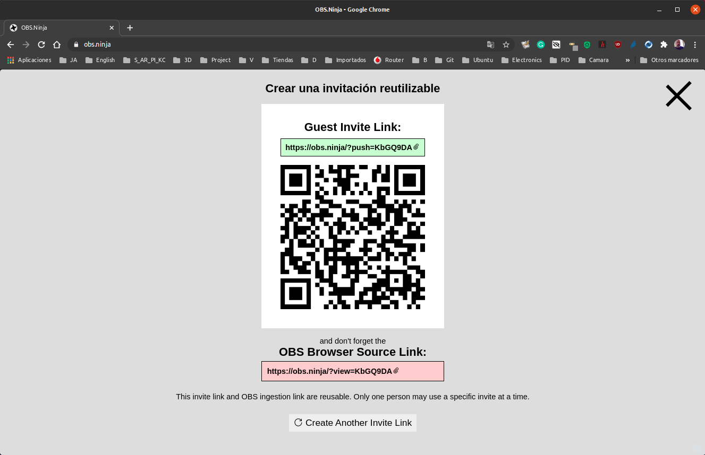 |
| Enlaces y QR de la invitación reutilizable |

Si copiamos el enlace o bien escaneamos el código QR con la cámara del smartphone se nos abrirá en el navegador una ventana que nos pide compartir la cámara. Debemos compartir los permisos de cámara y micrófono (si vamos a utilizarlo como entrada de audio). Se pueden usar tanto la cámara frontal como la trasera. Y podemos probar mediante el botón Test si el audio funciona correctamente. La situación en el móvil es la que vemos en la imagen 7a, donde pulsamos en Start y comenzamos la transmisión desde el móvil, situación que vemos en la imagen 7b.

| Imagen 7a | Imagen 7b |
|:-:|:-:|
| 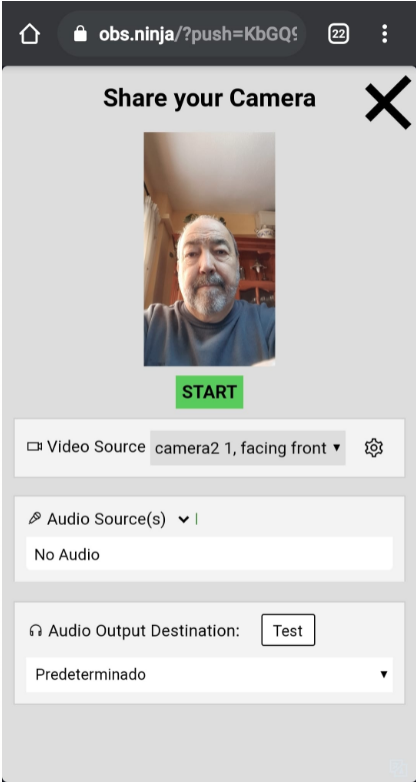 | 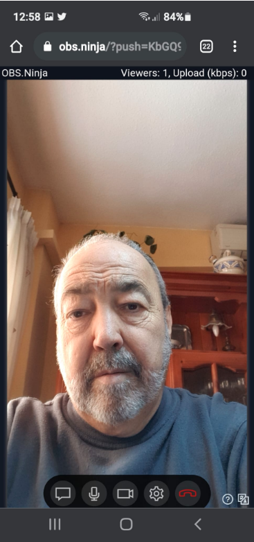 |
| Pantalla del movil antes de pulsar Start | [Pantalla del movil después de pulsar Start |

Nos dirigimos a OBS y configuramos una fuente Navegador tal y como vemos en la imagen 8. El ancho y el alto se han configurado para una resolución QHD (Quad HS) que se corresponde con una resolución cuádruple de alta definición estándar de 720p (1280x720 pixeles) que es en este caso la del móvil utilizado.

| Imagen 8 |
|:-:|
| 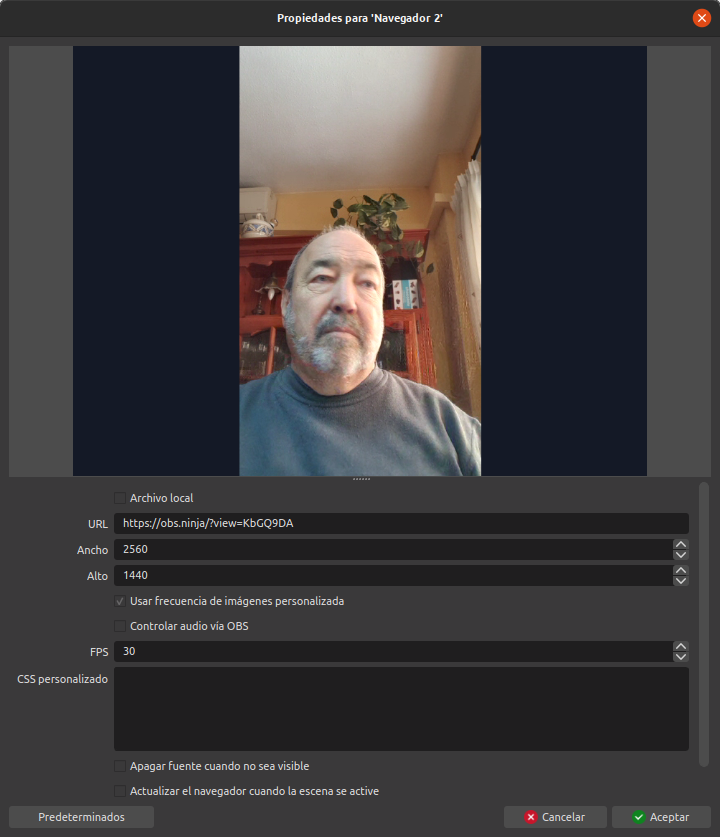 |
| Configuración de la fuente Navegador |

En la imagen 9 vemos el resultado en OBS una vez retocado el tamaño del recuadro contenedor.

| Imagen 9 |
|:-:|
| 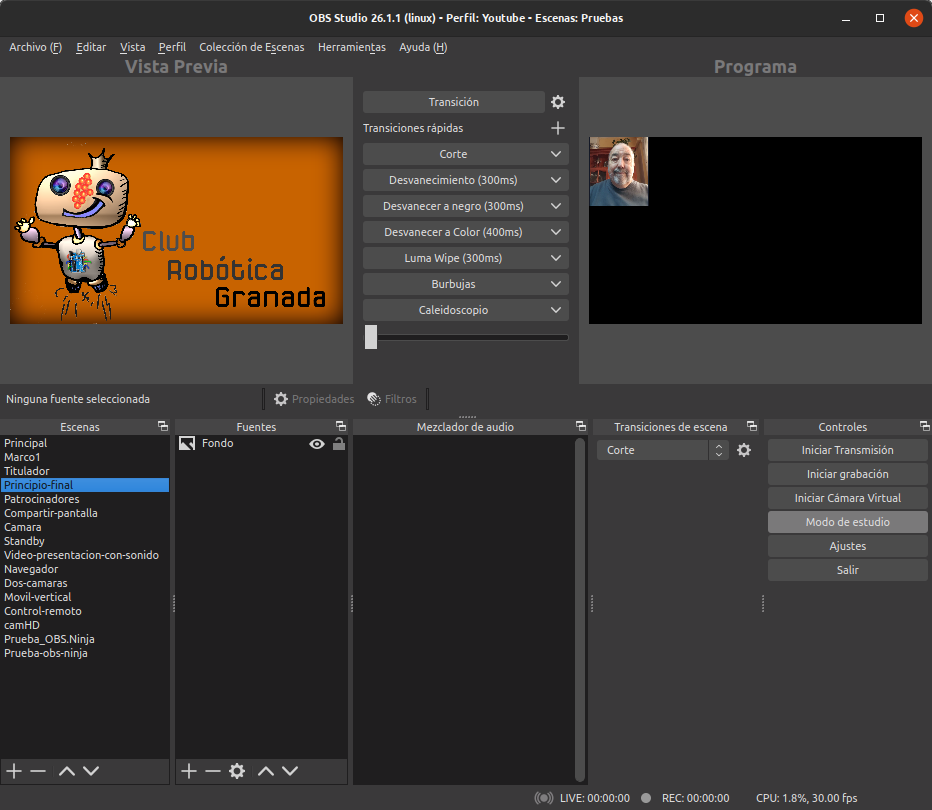 |
| Invitación reutilizable en OBS |

