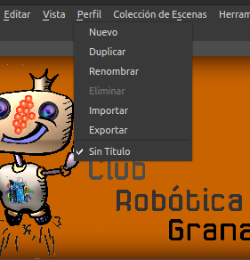
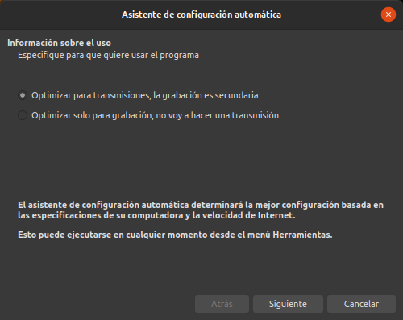
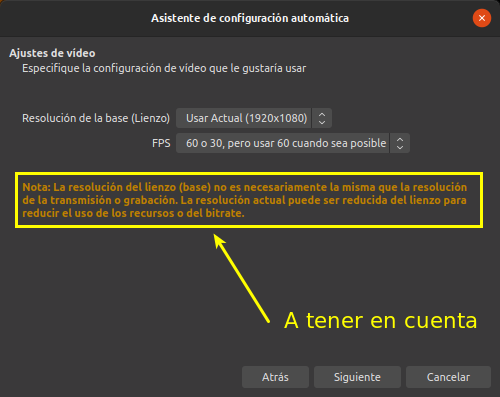
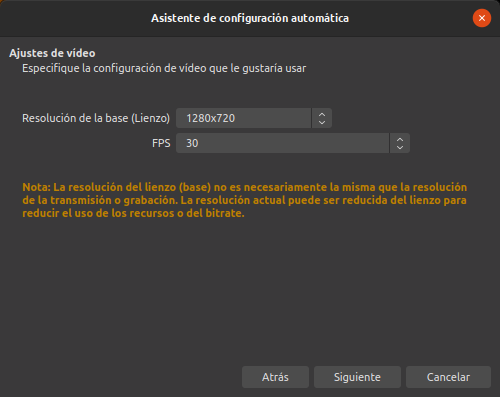
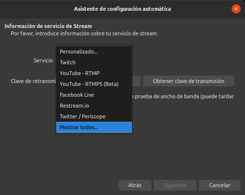
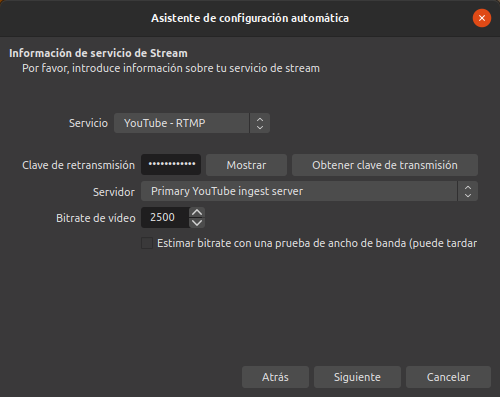
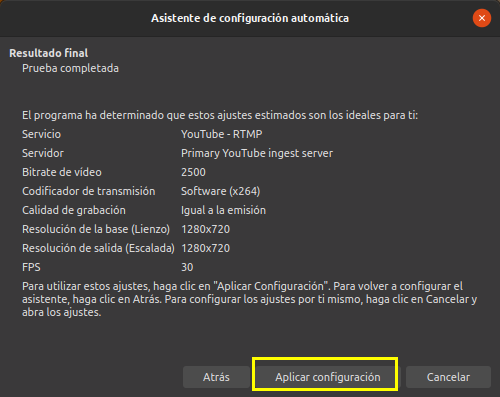

# Perfiles
Los perfiles nos van a servir para guardar todos los ajustes de OBS para las distintas tareas que queramos realizar con el programa, como por ejemplo un perfil para emitir en Youtube, otro para emitir en Twich u otro para grabar algo que se emitirá en diferido o se subirá a alguna plataforma.

Si no hemos creado previamente nuestro propio perfil se crea uno por defecto con nombre "Sin título", tal y como observamos en la imagen 1.

| Imagen 1 |
|:-:|
|  |
| Menú perfil |

Vamos a crear un perfil de pruebas para poder continuar con las configuraciones necesarias. Para ello escogemos la opción correspondiente del menú y en la ventana que se abre le ponemos un nombre y pulsamos en Ok. Esto lanzará el *Asistente de configuración automática* que vemos en la imagen 2. Este asistente lo tenemos disponible en el menú *Herramientas*.

| Imagen 2 |
|:-:|
|  |
| Menú perfil |

Escogemos la opción según lo que tengamos previsto hacer y pulsamos siguiente.

En la siguiente ventana, imagen 3, nos va a preguntar sobre los ajustes de video que vamos a utilizar referentes a la resolución del lienzo o base y los Frames (fotogramas) Por Segundo que vamos a usar. Esto lógicamente va a depender mucho del tipo de contenido porque no es lo mismo transmitir un directo para presentar un tema concreto o dar una conferencia, grabar un curso estar transmitiendo un juego.

| Imagen 3 |
|:-:|
|  |
| Asistente de configuración automática: Ajustes de video |

Para el caso de una videoconferencia una resolución de 1280x720 va a ser suficiente y consumirá muchos menos recursos que si lo hacemos a 1920x1080.

En el caso de los FPS la resolución mas habitual de las webcam es 30 FPS. En la imagen 4 vemos las configuraciones elegidas.

| Imagen 4 |
|:-:|
|  |
| Asistente de configuración automática: Ajustes de video elegidos |

La siguiente ventana nos solicita la información relativa al servicio de Stream que vamos a utilizar. Por defecto nos muestra los mas usuales pero existen muchos mas que podemos ver seleccionando *Mostrar todos*, tal y como se observa en la imagen 5.

| Imagen 5 |
|:-:|
|  |
| Asistente de configuración automática: Ajustes de stream |

En todos los servicios nos va a solicitar una *Clave de retransmisión* que debemos obtener del propio servicio. En el apartado [Obtener clave de retransmisión](../apartados/clave.md) tenemos descrito como obtenerla para Youtube y Twitch.

En la imagen 6 tenemos la configuración para el caso de Youtube-RTMP. Las siglas RTMP (del inglés **Real Time Streaming Protocol**) indican el protocolo de transmisión en tiempo real y establece y controla uno o muchos flujos sincronizados de datos.

| Imagen 6 |
|:-:|
|  |
| Asistente de configuración automática: Clave de retransmisión |

Respecto al Bitrate de video indicar que este va a depender de la resolución que le demos a nuestra transmisión y lógicamente deberá ser mayor cuanto mayor sea esta, es decir cuanta mas resolución mas datos debemos enviar a la nube y mas fácil va a ser tener problemas en la transmisión. Para el caso de 720 (la adoptada para este perfil) es suficiente con 2500.

Cuando hacemos clic en el botón "Siguiente" de la imagen 6 se inician una serie de pruebas para determinar los ajustes óptimos, tal y como vemos en la animación 1, finalizados los cuales se muestra la ventana resumen de la imagen 7, donde debemos pulsar el botón indicado para finalizar el asistente de configuración de nuestro perfil.

| Animación 1 |
|:-:|
|  |
| Pruebas de determinación de ajustes del perfil |

| Imagen 7 |
|:-:|
|  |
| Asistente de configuración automática: Resultado final |

Con esto ya tenemos configurado nuestro perfil para transmisión.
