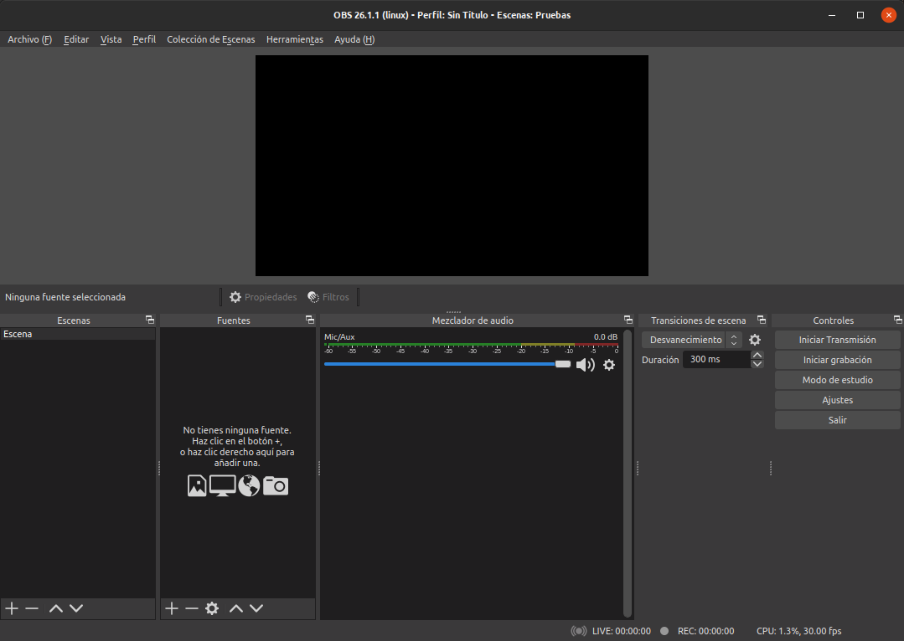

# Mis notas sobre OBS

Una serie de anotaciones sobre mi aprendizaje en el uso de Open Broadcaster Software (OBS), que es una aplicación libre y de código abierto para streaming, mantenida por OBS Project.

OBS permite la captura de video en tiempo real, componer la escena, codificar, grabar y retransmitir. La transmisión de datos puede realizarse a través del protocolo **Real Time Messaging Protocol (RTMP)**, y puede ser enviado a cualquier destino que tenga soporte RTMP (por ejemplo **Youtube**), incluye muchos presets para sitios de streaming como Twitch y DailyMotion.

