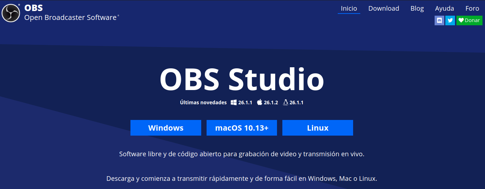
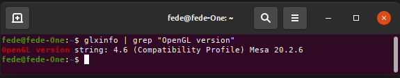

# Instalación de OBS
En la [wiki del proyecto OBS Studio](https://obsproject.com/wiki/) tenemos la entrada a las [instrucciones de instalación](https://obsproject.com/wiki/Install-Instructions) para todos los sistemas operativos disponibles (Imagen 1). Nosotros vamos a trabajar en Linux bajo Ubuntu 20.04.

| Imagen 1 |
|:-:|
|  |
| Versión de OBS disponibles para descarga |

En Linux se requiere OpenGL 3.3 o posterior para usar OBS Studio. Para comprobar que versión de OpenGL tiene nuestro equipo debemos teclear `glxinfo | grep "OpenGL version"` en una Terminal que nos deberá devolver algo similar a lo que vemos en la imagen 1.

| Imagen 2 |
|:-:|
|  |
| Versión de OpenGL en nuestro ordenador |

Si no tenemos instalado Glxinfo podemos hacerlo tecleando `sudo apt-get install mesa-utils` en una Terminal.

En Ubuntu se requiere FFmpeg. Si no lo tenemos instalado basta con teclear `sudo apt install ffmpeg` en una terminal para solventar el requerimiento.

Instalamos OBS con los siguientes comandos:
  `sudo add-apt-repository ppa:obsproject/obs-studio`  
  `sudo apt update`  
  `sudo apt install obs-studio`  

Con esto ya debemos tener el programa disponible en nuestras aplicaciones.

| Imagen 3 |
|:-:|
|  |
| Icono de OBS en aplicaciones |

