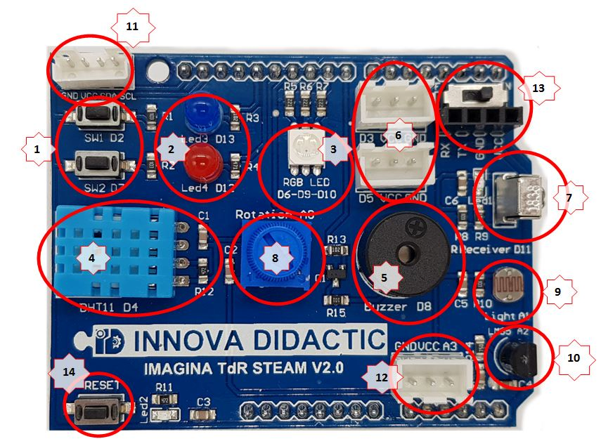
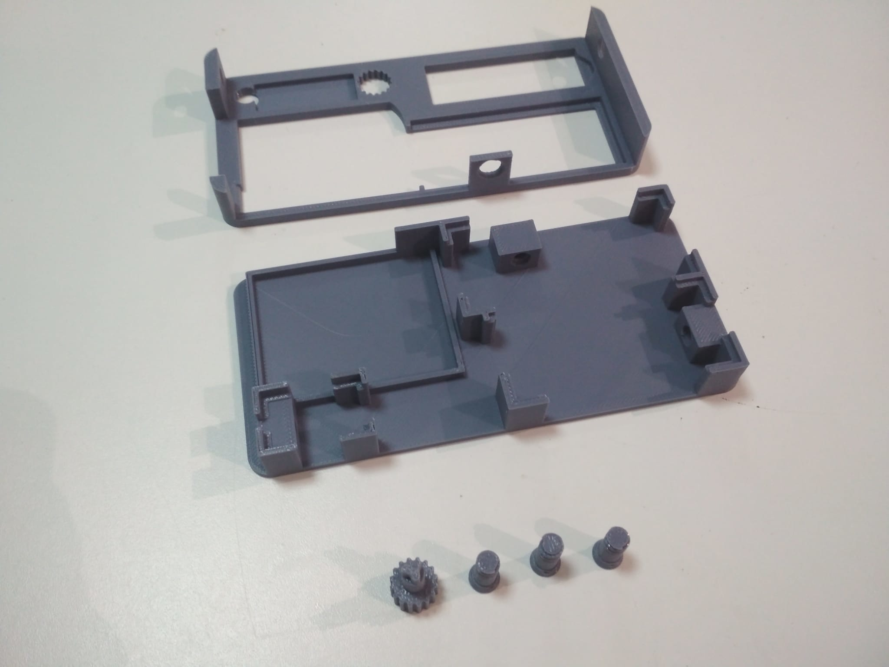
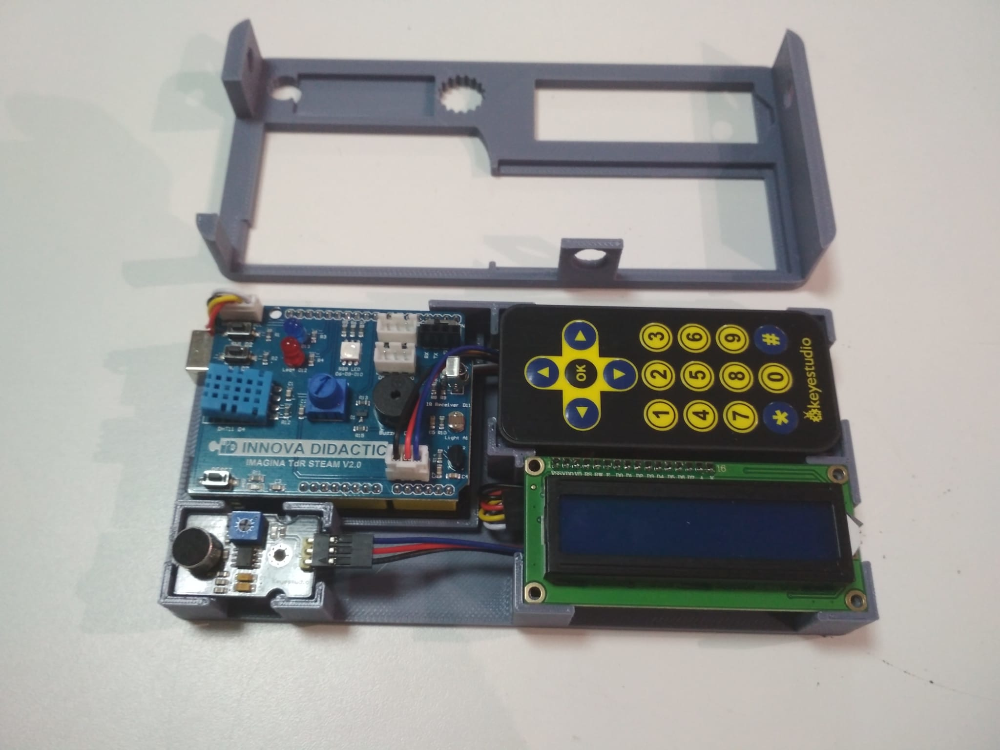
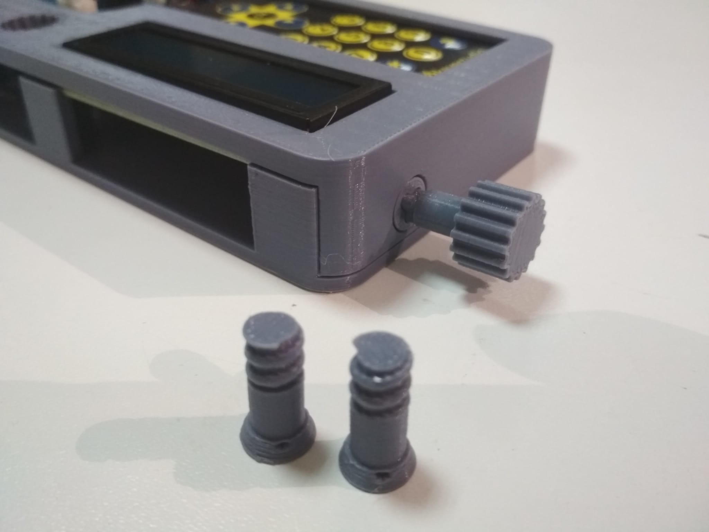
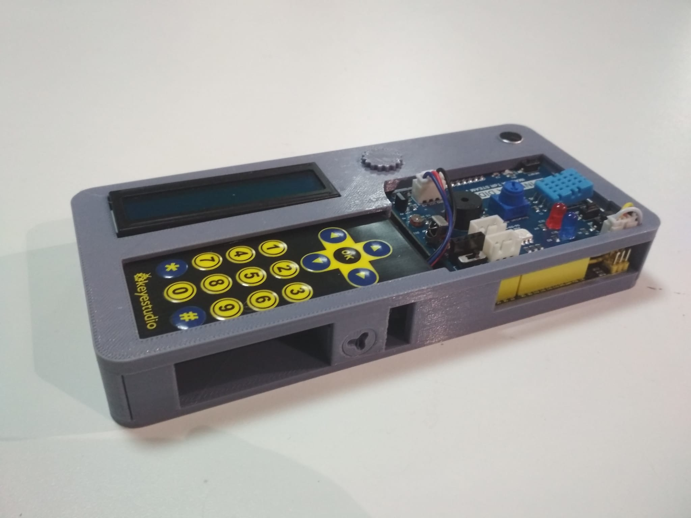

# Ejemplo de un programa completo
Este es un ejemplo de un posible programa completo en el que realizo una grabación de un programa con diferentes escenas para resumir los conceptos vistos hasta ahora.

Se utilizan dos cámaras, una webcam y la cámara de un móvil, para indicar los elementos que contiene la Shield Imagina TdR STEAM V2.0 de [Innova Didactic](https://shop.innovadidactic.com/es/) y presentar la caja para alojar el kit TdR-STEAM que ha diseñado Eduard Casadevall.

Para disponer de la información descriptiva de los elemento de la shield en forma gráfica tenemos la imagen 1.

| Imagen 1 |
|:-:|
|  |
| Componentes TdR STEAM V2.0 |

En la tabla se describen los elementos según las referencias de la imagen 1.

| Referencia 1 | Pin(s) | Descripción |
|:-:|:-:|---|
| 1 | Pulsadores SW1 y SW2 | D2 y D7 |
| 2 | Diodos LEDs Azul y Rojo | D13 y D12 |
| 3 | LED RGB | D6, D9 y D10 |
| 4 | Sensor temperatura y humedad DHT11 | D4 |
| 5 | Buzzer | D8 |
| 6 | Conectores entrada/salida | D3 y D5 |
| 7 | Receptor IR | D11 |
| 8 | Potenciometro giratorio | A0 |
| 9 | Sensor de luminosidad (LDR) | A1 |
| 10 | Sensor de temperatura (LM35) | A2 |
| 11 | Interface I2C SDA y SCL | A4 y A5 |
| 12 | Entrada analógica | A3 |
| 13 | Comunicaciones BT y WiFi (interruptor on/off) | Rx y Tx  |
| 14 | Reset |  |

Se comercializa el [Kit Placa Imagina TdR STEAM + Arduino](https://shop.innovadidactic.com/es/para-centros-educativos/1445-kit-placa-imagina-tdr-steam-arduino.html) con los siguientes elementos:

* 1 Shield Imagina TdR STEAM Versión 2
* 1 Placa Keyestudio UNO
* 1 Pantalla LCD de 16 caracteres por 2 líneas con fondo azul conectada al puerto I2C
* 1 Mando a distancia
* 1 Micrófono para detectar sonidos
* 1 Cable para conectar pantalla al puerto I2C de la shield Imagina TdR STEAM Versión 2
* 2 Cable de conexión de entrada y salidas a los puertos digitales y analógicos
* 1 Cable USB para conectar la placa Keyestudio UNO al ordenador

Los elementos (excepto los cables de puertos y el USB) se alojan en una caja diseñada en 3D por Eduard Casadevall que tiene el aspecto que vemos en las imágenes 2, 3, 4 y 5.

| Imagen 2 | Imagen 2 | Imagen 2 | Imagen 2 |
|:-:|:-:|:-:|:-:|
|  |  |  |  |
| Partes impresas | Colocación | Cierre | Conjunto |

Los archivos stl para imprimir la caja están disponibles en los siguientes enlaces:

| Archivo | Unidades |
|---|:-:|
| [Caja](../img/caja/caja.stl) | 1 |
| [Tapa](../img/caja/tapa.stl) | 1 |
| [Tornillo](../img/caja/tornillo.stl) | 3 |
| [Destornillador](../img/caja/destornillador.stl) | 1 |
| [Todos en un zip](../img/caja/caja-TdR-STEAM.zip)

En el video siguiente tenemos la descripción y el montaje detallados.

| Vídeo |
|:-:|
| [Presentación del kit TdR-STEAM y ensamble en su caja](https://youtu.be/5pmNKW-lyUw) |

