# Configuraciones y ajustes
Lo primero que debemos decidir es la resolución con la que vamos a emitir en directo nuestro evento y para ello vamos a tener en cuenta los siguientes aspectos y definiciones:

## Resolución
Escogemos entre [HD (Alta definición) o 720p](https://es.wikipedia.org/wiki/Alta_definici%C3%B3n) o [Full HD o 1080p](https://es.wikipedia.org/wiki/1080p). Esto va a depender mucho de las características del equipo con el que vamos a transmitir y del ancho de banda de nuestra conexión a internet. No es usual realizar transmisiones a mayores resoluciones que las indicadas. En la imagen 1 vemos gráficamente las resoluciones indicadas.

| Imagen 1 |
|:-:|
| 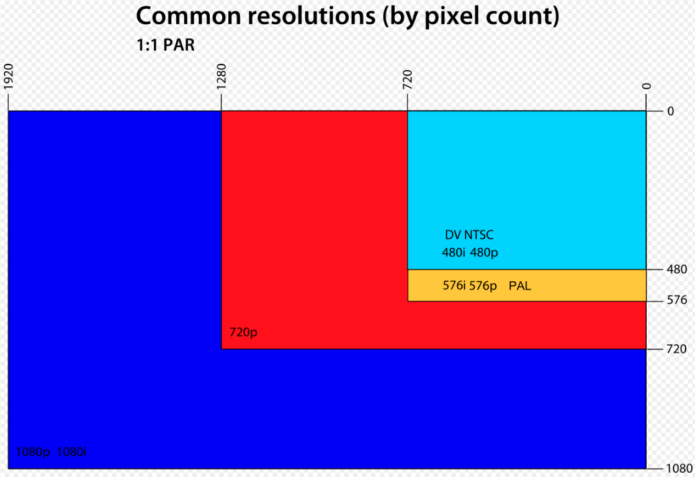 |
| Resoluciones por pixels - [Fuente: Wikipedia](https://es.wikipedia.org/wiki/Alta_definici%C3%B3n#/media/Archivo:Common_Video_Resolutions.svg) |

En la tabla siguiente se comparan ambas resoluciones y se indica la mas aconsejable según lo que tengamos previsto hacer.

| Resolución | Observaciones |
|:-:|---|
| 1080p | Mejor calidad  Escenas con mucho detalle  Mejor para el usuario  Gran consumo de recursos  |
| 720p | Calidad aceptable  Escenas o streaming sencillo  Consume menos recursos  |

Siempre es conveniente, cuando hablamos de resolución, comenzar por un valor mas bajo para posteriormente aumentarlo si se considera necesario. Para transmitir videoconferencias, talleres con presentaciones y este tipo de eventos es suficiente una resolución de 1280x720 pixels.

## Tamaño del lienzo
Se refiere a la base o tamaño de ventana por defecto que podemos seleccionar en el apartado vídeo dentro de ajustes. En la imagen 2 vemos las resoluciones disponibles. La elección del tamaño del lienzo con el que vamos a trabajar de forma predeterminada es una decisión importante para futuras configuraciones.

| Imagen 2 |
|:-:|
| 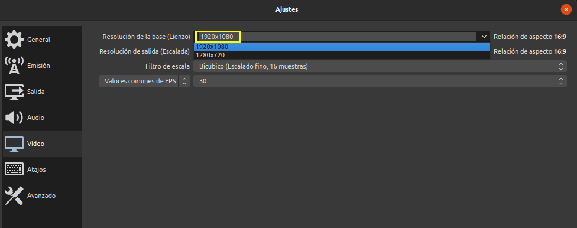 |
| Resoluciones base |

En mi caso siempre escojo 1920x1080 como tamaño de lienzo para la creación de imágenes de forma que así la fuente escogida para la escena se adapte al lienzo que ponga en OBS perfectamente. La resolución del lienzo en OBS es el tamaño de la pantalla donde vamos a montar todas nuestras escenas con sus fuentes.

## Resolución de salida o escalada
Se refiere a la resolución con la que vamos a realizar la grabación en OBS si la seleccionamos. Para el caso de videoconferencias, talleres online y eventos, donde básicamente se va a trabajar con webcams y capturando la ventana de otros participantes, vamos a configurar a 1280x720 pixels, consiguiendo así consumir los menos recursos posibles en nuestro ordenador. En la imagen 3 vemos los ajustes de video finalmente escogidos.

| Imagen 3 |
|:-:|
| 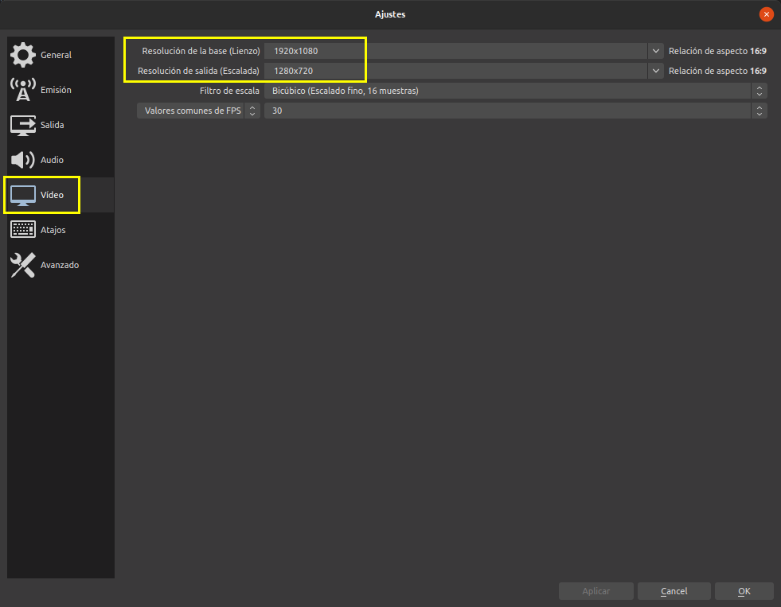 |
| Ajustes de vídeo |

## Filtro de escalado
Este filtro nos va a ayudar a conseguir una imagen más nítida aunque se añade algo de carga al encoder. Las opciones disponibles son las siguientes:
- Bilineal, que es más rápido, pero borroso si se escala la imagen
- Bicúbico, escalado fino, 16 muestras
- Lanczos,escalado fino, 32 muestras.
- Área, suma ponderada 4/6/9 muestras

El ajuste bicúbico es el que adoptaremos en nuestro caso.

## Frames o fotogramas por segundo (FPS)
Aquí básicamente vamos a depender del tipo de cámaras que se utilicen. Para el caso de webcams y grabaciones de pantalla es suficiente con 30 FPS. Si requerimos alta resolución se puede usar 48 o 60 FPS y si usamos cámaras la resolución la ajustamos a 25 o 29,97 FPS.

## Ajustes avanzados
En la imagen 4 vemos las selecciones de ajustes avanzados escogidas para usar.

| Imagen 4 |
|:-:|
| 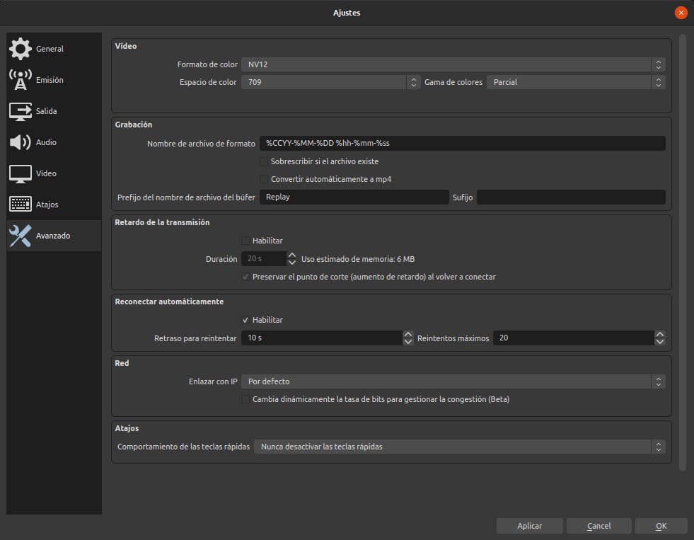 |
| Ajustes avanzados |

Indicar que podemos habilitar y configurar un determinado retardo en la emisión si resulta necesario, pero no debemos utilizarlo si no es estrictamente necesario dado que consume memoria RAM y esto puede afectar al resto de la transmisión.

## Ajustes de Salida. 
En estos ajustes no vamos a requerir mas que el modo sencillo de salida, aunque lógicamente está disponible el modo avanzado que aquí vamos a omitir. En la imagen 5 vemos los ajustes por defecto que nos muestra OBS.

| Imagen 5 |
|:-:|
| 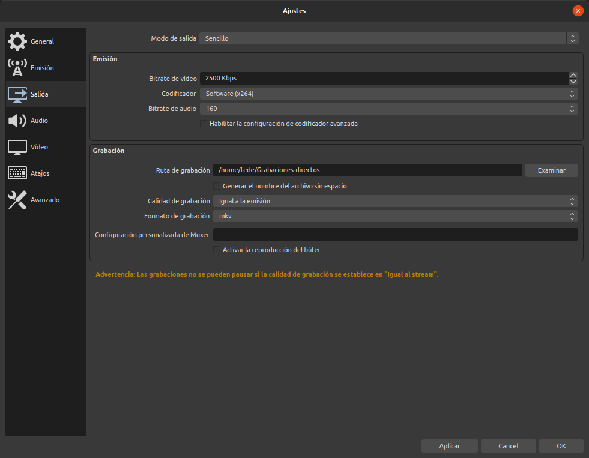 |
| Ajustes de salida |

Observamos como la configuración de salida se divide en dos partes, la referida a emisión y la de grabación. 

### Emisión
El bitrare de video es la velocidad de emisión de salida expresada en kilobits por segundo. Esta velocidad de emisión está limitada por dos factores:
* El primero es la velocidad de subida de nuestra propia conexión a internet. Esta velocidad la podemos comprobar por ejemplo en [test-velocidad.com](https://www.test-velocidad.com/speedtest) que nos suministrará algo similar a la imagen 6, donde se observa que en mi caso es de algo mas de 100 Mb/s.

| Imagen 6 |
|:-:|
| 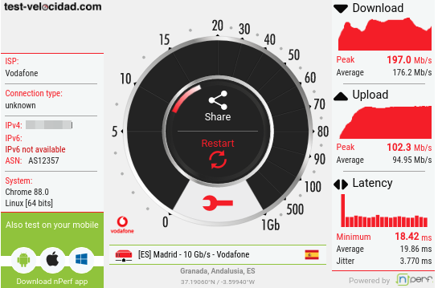 |
| Resultados test velocidad conexión |

En la imagen 5 podemos ver que el bitrate está a 2500 kb/s o lo que es lo mismo 2.5 Mb/s. En cualquier caso la velocidad de subida de nuestra conexión deberá ser al menos el doble de esta para dejar la posibilidad de que por la conexión suban otro tipo de datos y para que la conexión sea fluida. En el caso que se observa en la imagen 6 es evidente que estamos muy por encima y que no debe existir ningún problema para emitir con la configuración actual.

* El segundo factor que condiciona nuestra emisión va a ser la plataforma en la que vayamos a emitir y aquí no nos queda mas remedio que recurrir a la información que esas plataformas nos den sobre el tema. Veamos las dos que estamos describiendo en estas notas.

Los [requerimientos de streaming de Youtube](https://support.google.com/youtube/answer/2853702?hl=es&ref_topic=9257892#zippy=%2Cp%2Cp-a-fps) se pueden consultar en el enlace y en la imagen 7 vemos los datos para las dos resoluciones que estamos tratando. En el enlace existe mucha mas información interesante sobre streaming en Youtube.

| Imagen 7 |
|:-:|
| 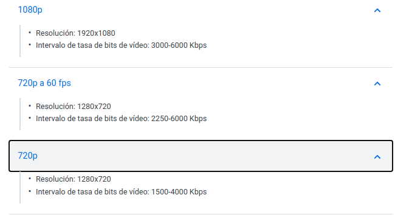 |
| Requerimientos de streaming de Youtube |

Los [requerimientos de streaming de Twitch](https://stream.twitch.tv/encoding/) los vemos en el enlace y podemos observar que son similares a los anteriores. En la imagen 8 vemos la información para el codec x264, que en mi caso es el único que puedo seleccionar.

| Imagen 8 |
|:-:|
| 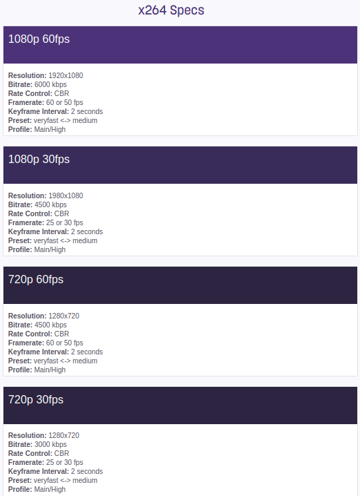 |
| Requerimientos de streaming de Twitch |

Si vamos a emitir a 1280x720 un bitrate de entre 2500 y 3500 kb/s será el adecuado y lo lo vamos a hacer en 1920x1080 podemos subir este bitrate a un valor entre 4500 y 6000 kb/s

Estos cambios en configuraciones pueden ocasionar que estemos en una escena ajustada a una resolución y escojamos una diferente de forma que la pantalla no se verá correctamente. Esto se soluciona de forma sencilla si nos situamos sobre la fuente, hacemos clic con botón secundario y escogemos ajustar a la pantalla de la entrada Transformar. En la animación 1 vemos el proceso que hay que seguir partiendo de una imagen de fondo con resolución 1920x1080 para una emisión a 1280x720.

| Animación 1 |
|:-:|
| 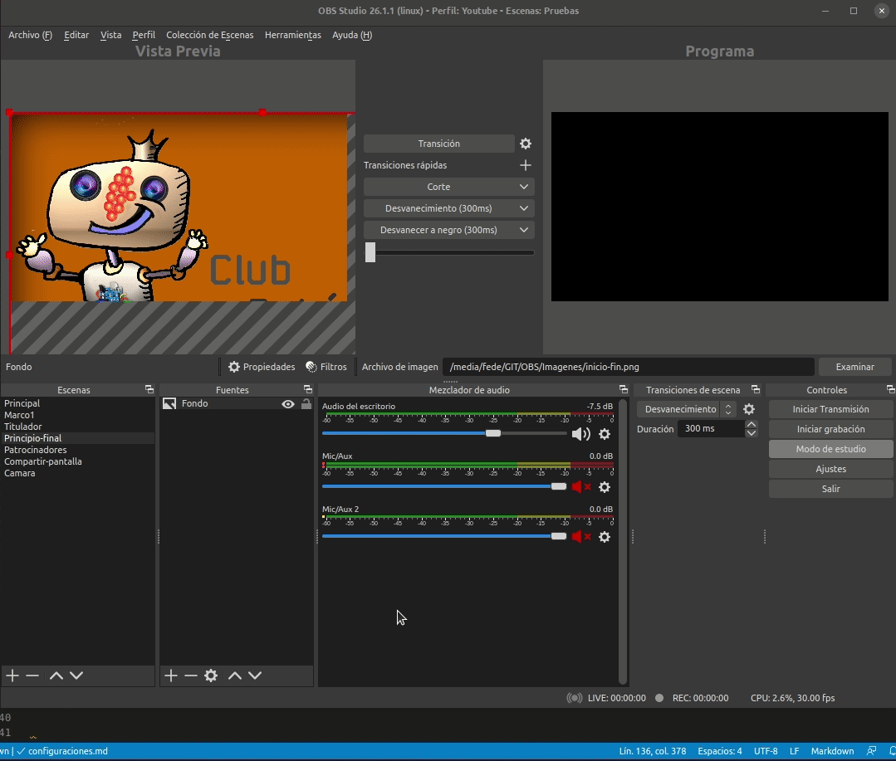 |
| Ajuste a la pantalla |

En la imagen 9 vemos la configuración final adoptada.

| Imagen 9 |
|:-:|
| 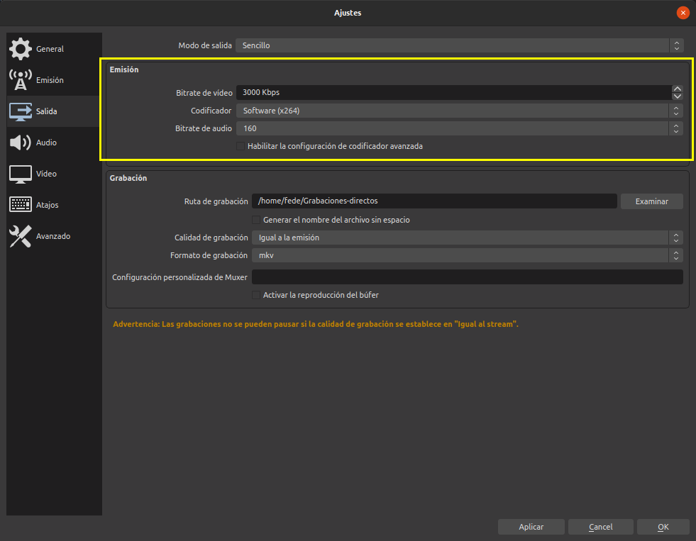 |
| Configuración de emisión |

Indicar que el bitrate de audio mas usual que garantiza una buena calidad del mismo es de 160 o 128 si el ancho de banda es ajustado.

### Grabación
Estos ajustes básicamente se explican por si mismos los que nos interesan por ahora y los vemos en la imagen 10.

| Imagen 10 |
|:-:|
| 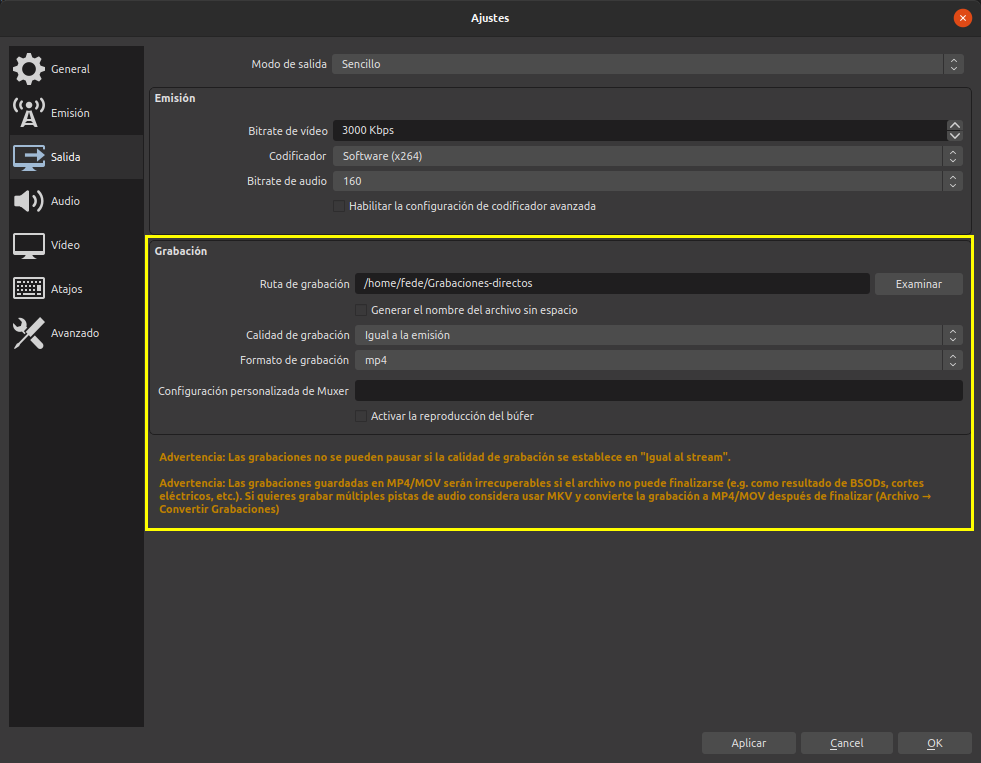 |
| Configuración de grabación |

He seleccionado como formato de grabación mp4 precisamente para ver la advertencia que no muestra abajo referente a que será irrecuperable si por algún motivo el archivo no puede finalizarse. En esa misma advertencia nos avisa de que si grabamos en formato mkv se solventan esos problemas y que tan sólo hay que convertir el archivo una vez finalizada la grabación al formato deseado.

En la animación 2 vemos el proceso con un archivo de ejemplo que se convierte de mkv a mp4.

| Animación 2 |
|:-:|
| 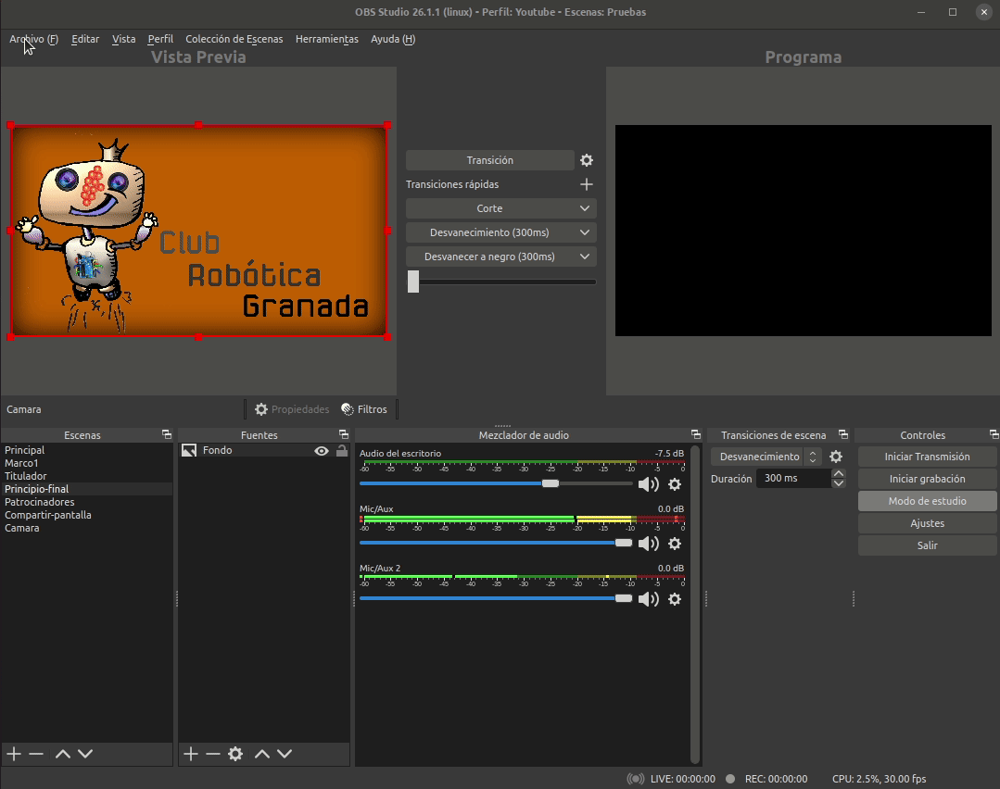 |
| Convertir formato mkv a mp4 |

Si tenemos problemas de ancho de banda podemos bajar los bitrates de video a valores inferiores y fijar el de audio en 128. Por debajo de este valor de bitrate de audio podemos tener problemas de audición.
