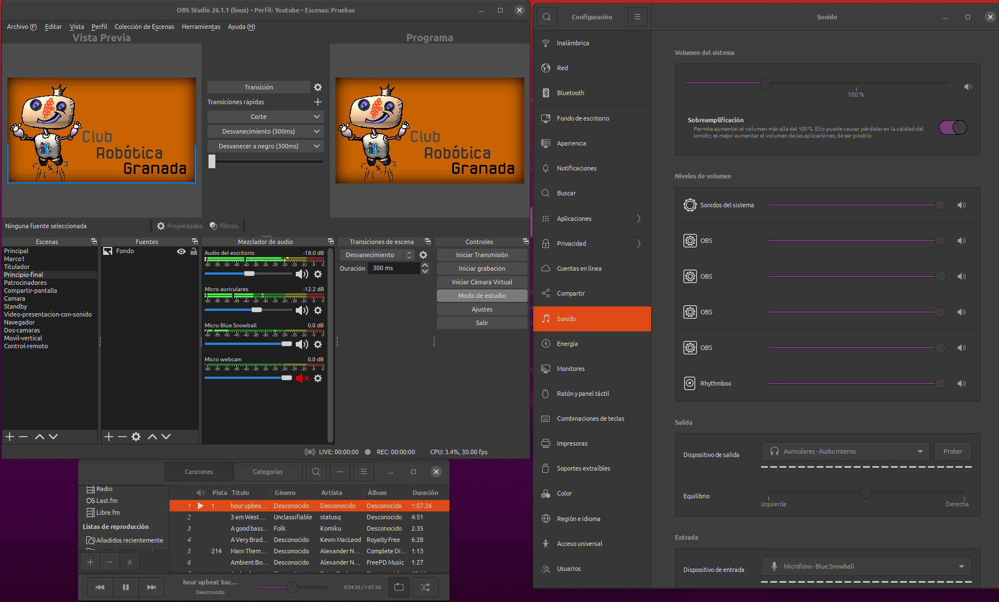
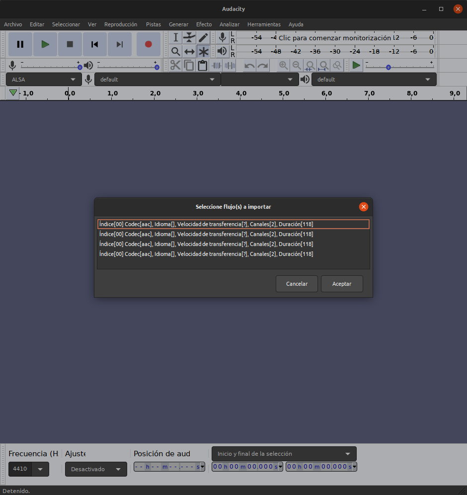
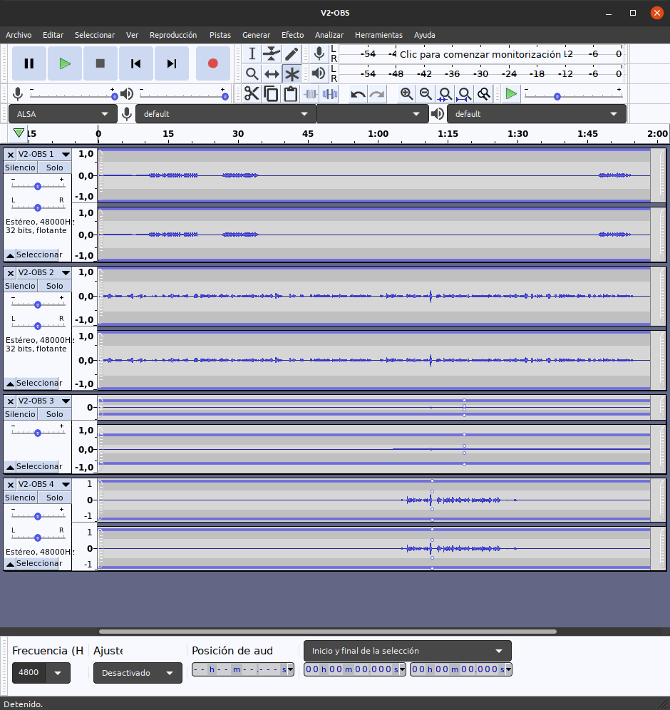
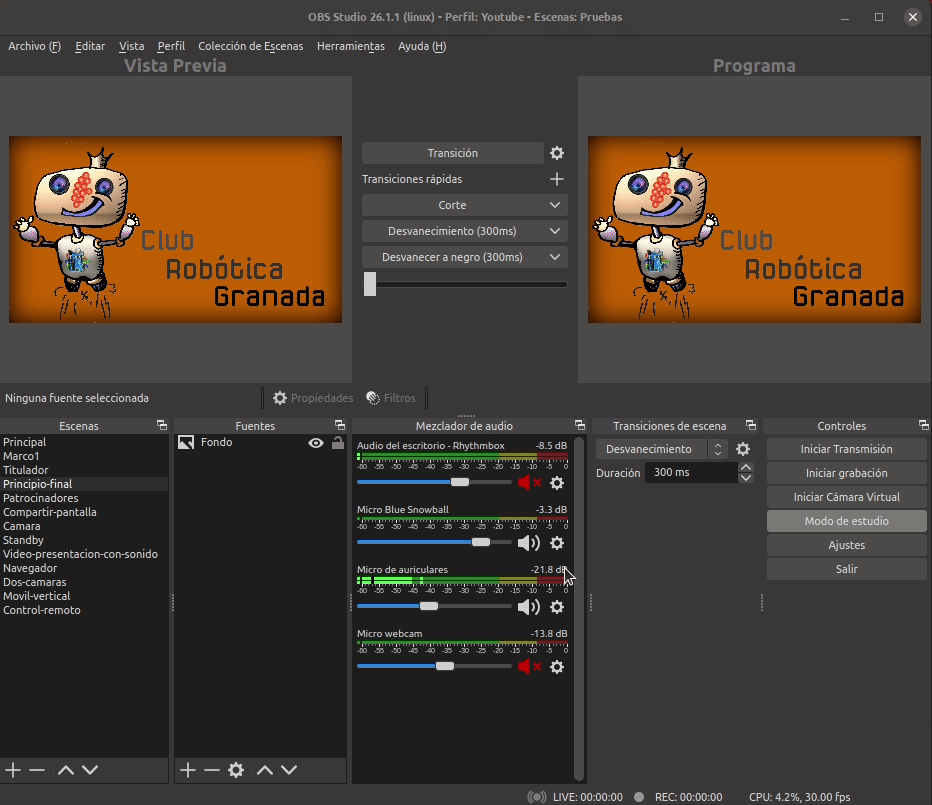
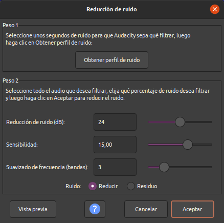

# El audio en OBS
El tema del audio es probablemente de los mas importantes cuando hacemos transmisiones o grabamos contenidos. 

## Canales y pistas
Vamos a comenzar por ver como están organizados los dispositivos de audio en los ajustes de OBS. En la imagen 1 vemos las seis entradas independientes (organizadas por pistas) de que disponemos, dos para el audio de escritorio y cuatro entradas de micrófono.

| Imagen 1 |
|:-:|
|  |
| Entradas de audio en OBS |

Cuando hablamos de audio de escritorio nos referimos al audio encargado de capturar los sonidos internos de nuestro ordenador como los de un reproductor de audio o video. Las entradas de micrófono nos van a permitir conectar micros externos, el micro de la webcam, etc.

Si vamos a grabar un programa que posteriormente vamos a post-producir es importante que esas seis entradas/pistas de audio estén separadas para poderlas manejar de forma independiente. Cuando emitimos en directo todo el audio saldrá por un canal.

En los ajustes de salida podemos seleccionar la pista de audio que queremos usar, normalmente la 1 tal y como se muestra en la imagen 2.

| Imagen 2 |
|:-:|
|  |
| Pista de audio para emisión |

En esta situación podemos escoger solamente una salida para emisión, lo cual es perfectamente lógico y tiene poco sentido emitir por varias pistas a un tiempo.

Cuando estamos en la pestaña *Grabación* podemos seleccionar hasta seis pistas para grabar, tal y como se observa en la imagen 3.

| Imagen 3 |
|:-:|
|  |
| Pista de audio para grabación |

En la animación 1 vemos el proceso de activación del micrófono de la webcam y como este aparece reflejado en el mezclador.

| Animación 1 |
|:-:|
|  |
| Activación de una entrada de micrófono de webcam |

Se observa solamente una línea de variación dado que el micrófono es mono.

## Conexiones
Voy a mostrar un ejemplo sencillo de conexionado de posibles equipos con OBS con la única finalidad de explicar que lo que hemos referido hasta ahora como entradas de audio también actúan como salidas y ver también como mezclar estas entradas y salidas.

En la imagen 4 se ejemplifica el conexionado entre equipos externos analógicos y digitales y nuestro ordenador en el que tenemos instalado OBS.

| Imagen 4 |
|:-:|
|  |
| Conexiones de equipos analógicos y digitales |

Es evidente que cuando disponemos de equipos analógicos se hace necesaria una interfaz de audio que convierta nuestra señal analógica en digital para introducirla en nuestro ordenador.

Veamos el conexionado de varios equipos conectados por USB o Bluetooth a nuestro PC y como dirigirlos a las entradas adecuadas de OBS. Posteriormente veremos como preparar estas entradas como salidas de grabación multipista y que ventaja tiene.

El equipamiento a conectar es el siguiente:

- Sistema de altavoces inalámbricos Bluetooth: Bose Mini II SE Soundlink
- Cámara web de alta definición con micrófono incorporado, Webcam 720P: papalook PA150
- Micrófono digital USB a condensador, patrones polares Cardioide u Omnidireccional, respuesta en frecuencia 40 Hz a 18 kHz con una tasa muestra/word de 44.1 kHz/16 bit: Blue Snowball iCE
- Auriculares **No digitales** tipo teléfono móvil con micrófono incorporado y conexión TRRS (Tip - punta; Ring - anillo; Ring; Sleeve - carcasa metálica o GND) tipo jack 3.5mm: Audífonos AKG

Vamos a comenzar por conectar los auriculares con micrófono directamente a la entrada jack del ordenador. Nos vamos a ajustes de audio en OBS y establecemos la configuración que vemos en la imagen 5.

| Imagen 5 |
|:-:|
|  |
| Configuración de audio en OBS para auriculares con micrófono |

En la imagen 6 observamos el efecto de la configuración de audio establecida con el reproductor Rhythmbox reproduciendo audio.

| Imagen 6 |
|:-:|
|  |
| Mezclador de audio en OBS con auriculares con micrófono conectados |

Pero tenemos que tener **muy presente** que esta configuración hay que coordinarla con la configuración de audio establecida en el ordenador. En mi caso con Ubuntu 20.04 se establece como vemos en la imagen 7.

| Imagen 7 |
|:-:|
|  |
| Configuración de sonido en ordenador para auriculares con micrófono conectados |

Con estas configuraciones tenemos el control de audio de salida y de la entrada de micrófono en OBS y en los auriculares estaremos escuchando el sonido reproducido en el ordenador. En el video 1 observamos como se interactúa con estos elementos y podemos observar que el audio de micrófono y reproductor se mezclan y que este último no se silencia desde OBS y solamente se puede hacer desde el ordenador, dado que en este se establecen los auriculares como salida.

| Vídeo 1 |
|:-:|
| [Trabajo con auriculares con micrófono](https://youtu.be/9WeSYFao674) |

## Separación de canales en grabación
Vamos a realizar una grabación partiendo de una situación como la que vemos en la imagen 8 para mostrar la separación en pistas de los audios implicados. En la imagen 8 se muestra OBS junto al reproductor y a la configuración de sonido del ordenador.

| Imagen 8 |
|:-:|
|  |
| Entorno para mostrar las pistas de salida de audio |

Para mostrar lo dicho vamos a partir de una configuración preestablecida que se sabe que funciona e iré describiendo lo que voy haciendo. Vamos a a tener música en reproducción y tres entradas diferentes de micrófono y la idea es separar estas fuentes de sonido en pistas diferente que permitan un posprocesado efectivo sobre cada audio.

En el video 2 vemos las configuraciones a realizar y el proceso de trabajo.

| Vídeo 2 |
|:-:|
| [Trabajo con cuatro canales de audio separados para posproducción](https://youtu.be/1CJsinpp18I) |

En el video anterior vemos al final que se realiza una grabación con OBS en la que deben existir cuatro canales de audio. Si abrimos el software de edición de audio [Audacity](https://www.audacityteam.org/), que tiene la capacidad de extraer el audio de un vídeo para trabajar con el mismo, e le damos a abrir el archivo con extensión mkv generado veremos una ventana como la de la imagen 9.

| Imagen 9 |
|:-:|
|  |
| Cuatro pistas de audio listas para importar |

Si seleccionamos las cuatros pistas y hacemos clic en el botón `Aceptar` Audacity procederá a leer las cuatro pistas de audio que nos mostrará por separado, tal y como podemos ver en la imagen 10.

| Imagen 10 |
|:-:|
|  |
| Cuatro pistas de audio en Audacity |

Si en OBS convertimos el archivo mkv a mp4 podemos seguir un proceso totalmente similar al anterior y desde Audacity editar nuestros audios en posproducción para finalmente volverlos a unir al video por ejemplo con OpenShot Video Editor, donde tendremos que silenciar el audio original del video, poner en una pista diferente a la del video nuestro audio editado y exportar de nuevo el video.

## Eliminación de ruidos
Es muy posible que al hacer nuestra grabación en OBS tengamos algún tipo de captura de ruido blanco en nuestro micrófono y lo que vamos a hacer en este apartado en ver distintas formas de eliminarlo.

### Filtros
En OBS es muy simple aplicar filtros, para ello nos dirigimos a la rueda dentada existente en el elemento del mezclador de audio que queremos filtrar, escogemos filtros en el menú que se despliega y en la ventana que se abre con el signo + añadimos los filtros que necesitemos de los que nos salen en el listado. En la animación 2 vemos el proceso de aplicar dos filtros al micrófono de los auriculares.

| Animación 2 |
|:-:|
|  |
| Aplicación de filtros en OBS |

### Eliminación de ruidos con Audacity
Si por cualquier motivo el video que hemos grabado tiene ruido blanco de fondo con Audacity es posible eliminarlo o al menos atenuarlo. Para ello debemos seguir el siguiente procedimiento:

* Seleccionamos un trozo de pista en la que sólo se escuche el ruido de fondo, lo que generalmente ocurrirá al comienzo del video.

* Nos dirigimos a la entrada de menú Efecto y escogemos Reducción de ruido y en la ventana que se nos muestra (imagen 11) seleccionamos el botón Obtener perfil del ruido.

| Imagen 11 |
|:-:|
|  |
| Obtener perfil de ruido en Audacity |

* Ahora vamos al menú Seleccionar y escogemos Todo, o pulsamos la combinación de teclas Ctrl + A, y vamos de nuevo a Efecto y  Reducción del ruido. Ajustamos los valores de Reducción de ruido y Sensibilidad para eliminar el ruido seleccionado y hacemos clic en el botón Aceptar, y tras unos instantes tendremos nuestro audio con el ruido escogido al principio eliminado del mismo.

* Finalmente vamos a Archivo y escogemos Exportar. Le damos un nombre al archivo y escogemos como tipo de archivo mp3 o cualquiera de los que nos muestra Audacity. Ya podemos usar el audio sin ruido para corregir el problema en nuestro video con ruido de fondo.

En el video 3 se ilustra gráficamente el proceso.

| Vídeo 3 |
|:-:|
| [Eliminación de ruido con Audacity](https://youtu.be/jMuckFDvr7k) |

