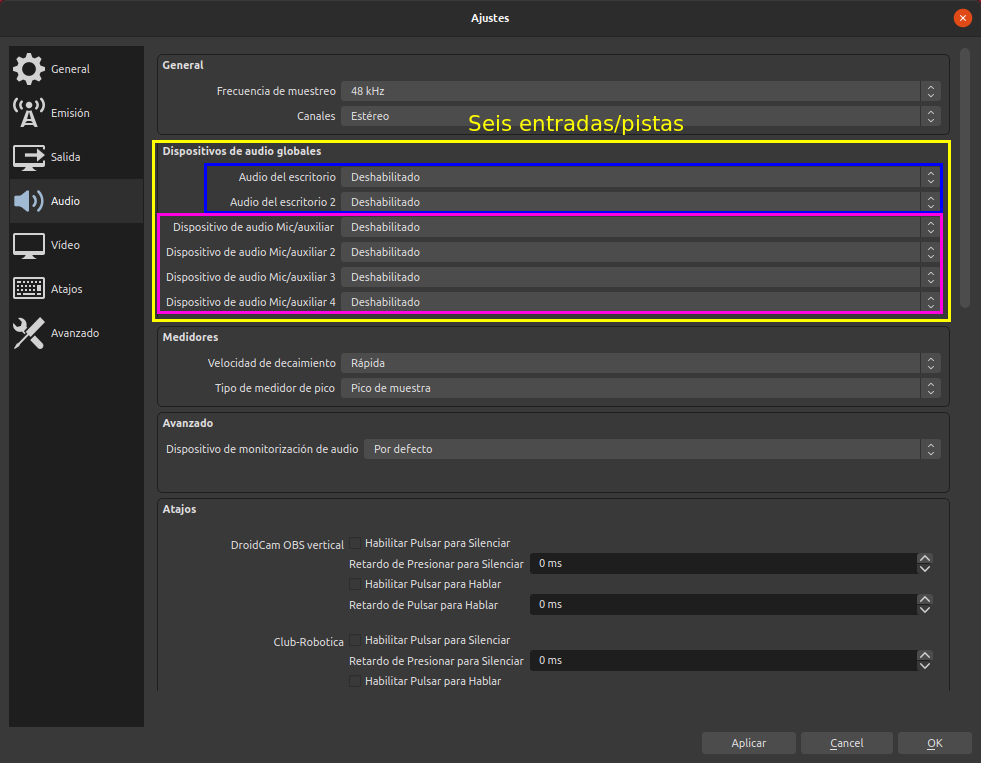
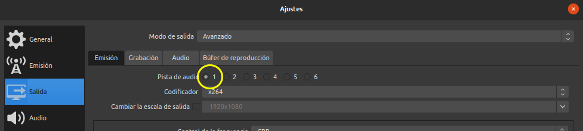
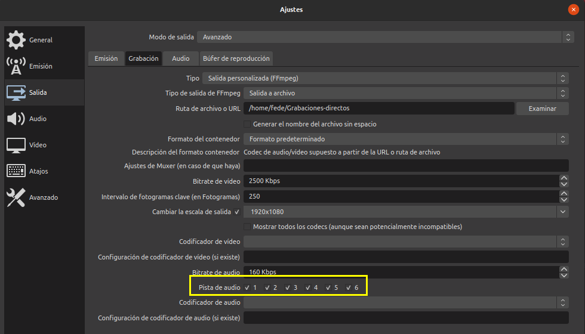
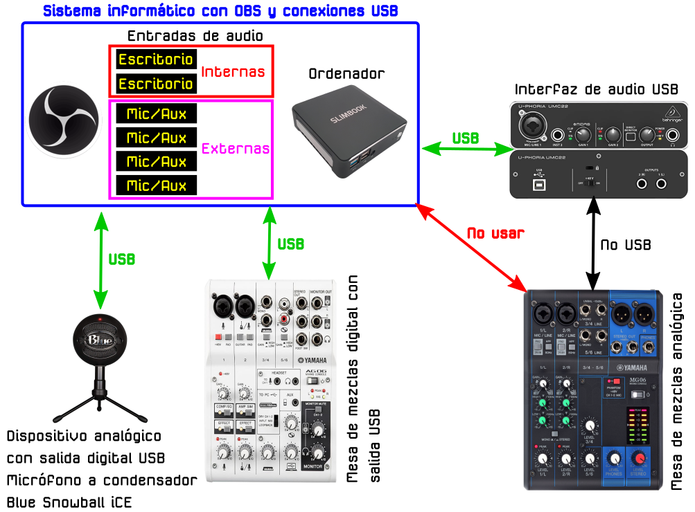
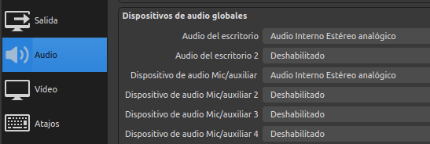
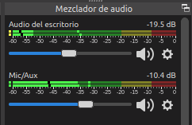
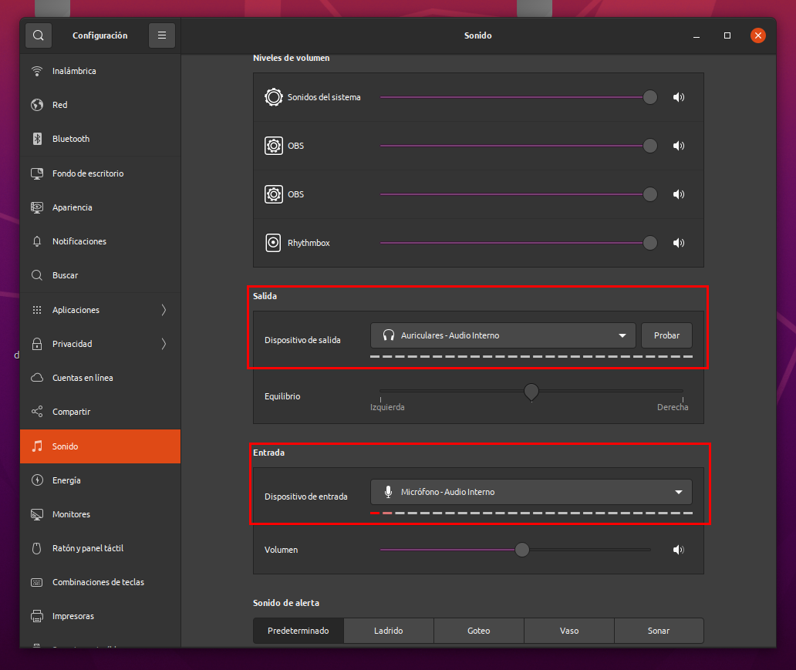

# El audio en OBS
El tema del audio es probablemente de los mas importantes cuando hacemos transmisiones o grabamos contenidos. 

## Canales y pistas
Vamos a comenzar por ver como están organizados los dispositivos de audio en los ajustes de OBS. En la imagen 1 vemos las seis entradas independientes (organizadas por pistas) de que disponemos, dos para el audio de escritorio y cuatro entradas de micrófono.

| Imagen 1 |
|:-:|
|  |
| Entradas de audio en OBS |

Cuando hablamos de audio de escritorio nos referimos al audio encargado de capturar los sonidos internos de nuestro ordenador como los de un reproductor de audio o video. Las entradas de micrófono nos van a permitir conectar micros externos, el micro de la webcam, etc.

Si vamos a grabar un programa que posteriormente vamos a post-producir es importante que esas seis entradas/pistas de audio estén separadas para poderlas manejar de forma independiente. Cuando emitimos en directo todo el audio saldrá por un canal.

En los ajustes de salida podemos seleccionar la pista de audio que queremos usar, normalmente la 1 tal y como se muestra en la imagen 2.

| Imagen 2 |
|:-:|
|  |
| Pista de audio para emisión |

En esta situación podemos escoger solamente una salida para emisión, lo cual es perfectamente lógico y tiene poco sentido emitir por varias pistas a un tiempo.

Cuando estamos en la pestaña *Grabación* podemos seleccionar hasta seis pistas para grabar, tal y como se observa en la imagen 3.

| Imagen 3 |
|:-:|
|  |
| Pista de audio para grabación |

En la animación 1 vemos el proceso de activación del micrófono de la webcam y como este aparece reflejado en el mezclador.

| Animación 1 |
|:-:|
|  |
| Activación de una entrada de micrófono de webcam |

Se observa solamente una línea de variación dado que el micrófono es mono.

## Conexiones
Voy a mostrar un ejemplo sencillo de conexionado de posibles equipos con OBS con la única finalidad de explicar que lo que hemos referido hasta ahora como entradas de audio también actúan como salidas y ver también como mezclar estas entradas y salidas.

En la imagen 4 se ejemplifica el conexionado entre equipos externos analógicos y digitales y nuestro ordenador en el que tenemos instalado OBS.

| Imagen 4 |
|:-:|
|  |
| Conexiones de equipos analógicos y digitales |

Es evidente que cuando disponemos de equipos analógicos se hace necesaria una interfaz de audio que convierta nuestra señal analógica en digital para introducirla en nuestro ordenador.

Veamos el conexionado de varios equipos conectados por USB o Bluetooth a nuestro PC y como dirigirlos a las entradas adecuadas de OBS. Posteriormente veremos como preparar estas entradas como salidas de grabación multipista y que ventaja tiene.

El equipamiento a conectar es el siguiente:

- Sistema de altavoces inalámbricos Bluetooth: Bose Mini II SE Soundlink
- Cámara web de alta definición con micrófono incorporado, Webcam 720P: papalook PA150
- Micrófono digital USB a condensador, patrones polares Cardioide u Omnidireccional, respuesta en frecuencia 40 Hz a 18 kHz con una tasa muestra/word de 44.1 kHz/16 bit: Blue Snowball iCE
- Auriculares **No digitales** tipo teléfono móvil con micrófono incorporado y conexión TRRS (Tip - punta; Ring - anillo; Ring; Sleeve - carcasa metálica o GND) tipo jack 3.5mm: Audífonos AKG

Vamos a comenzar por conectar los auriculares con micrófono directamente a la entrada jack del ordenador. Nos vamos a ajustes de audio en OBS y establecemos la configuración que vemos en la imagen 5.

| Imagen 5 |
|:-:|
|  |
| Configuración de audio en OBS para auriculares con micrófono |

En la imagen 6 observamos el efecto de la configuración de audio establecida con el reproductor Rhythmbox reproduciendo audio.

| Imagen 6 |
|:-:|
|  |
| Mezclador de audio en OBS con auriculares con micrófono conectados |

Pero tenemos que tener **muy presente** que esta configuración hay que coordinarla con la configuración de audio establecida en el ordenador. En mi caso con Ubuntu 20.04 se establece como vemos en la imagen 7.

| Imagen 7 |
|:-:|
|  |
| Configuración de sonido en ordenador para auriculares con micrófono conectados |

Con estas configuraciones tenemos el control de audio de salida y de la entrada de micrófono en OBS y los auriculares estaremos escuchando el sonido reproducido en el ordenador. En el video 1 observamos como se interactua con estos elementos y podemos observar que el audio de micrófono y reproductor se mezclan y que este último no se silencia desde OBS y solamente se puede hacer desde el ordenador, dado que en este se establecen los auriculares como salida.

| Vídeo 1 |
|:-:|
| [Trabajo con auriculares con micrófono](https://youtu.be/9WeSYFao674) |

## Separación de canales en grabación

En el video 1 podemos observar como se van activando los dispositivos en ajustes y como estos quedan reflejados en el mezclador de audio, donde podemos configurar su volumen, silenciarlos, etc.

00:56:14​ CONFIGURAR AUDIO
- Configuracion de audio PARTE 1: https://youtu.be/SNnjkfCwp9Q​
- Configuracion de audio PARTE 2: https://youtu.be/gu3U1qvcXeo​
00:59:54​ PISTAS DE AUDIO EN OBS
- Configuracion de audio PARTE 1: https://youtu.be/SNnjkfCwp9Q​
- Configuracion de audio PARTE 2: https://youtu.be/gu3U1qvcXeo​
01:02:31​ PROPIEDADES DE AUDIO AVANZADA
- Configuracion de audio PARTE 1: https://youtu.be/SNnjkfCwp9Q​
- Configuracion de audio PARTE 2: https://youtu.be/gu3U1qvcXeo​
01:05:32​ CONECTAR INTERFAZ DE AUDIO EN OBS
- https://youtu.be/K7Df-R8Lqvs​
01:10:51​ COMO CONFIGURAR MICROFONO USB EN OBS
- Video de apoyo: https://youtu.be/BRNxsyg0TZI​
- Sincronizar audio y video: https://youtu.be/H-sb1b-YlhM​
01:11:35​ COMO MEJORAR EL AUDIO DEL MICROFONO EN OBS
- Video de apoyo: https://youtu.be/39sHrTAKYDk