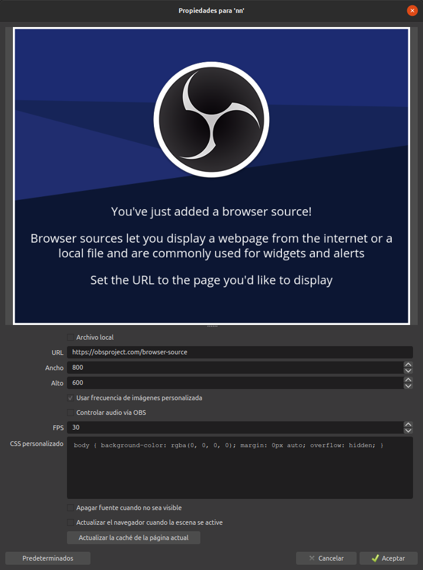
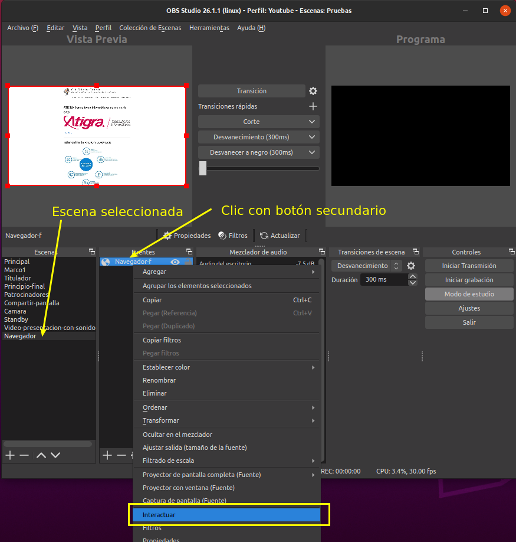
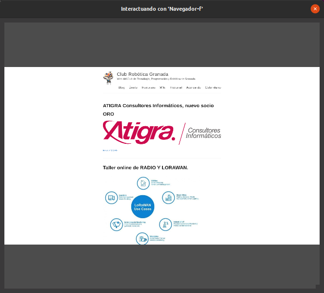

# Escena con fuente navegador
Vamos a ver aquí como crear una escena en la que la fuente sea un navegador para poder mostrar una página web y especialmente como se configuraría para poder interactuar con esa fuente.

Agregar una fuente de navegador nos va a permitir mostrar contenido basado en web en pantalla al copiar y pegar rápidamente la URL en la configuración de fuente de nuestro navegador.

Agregar una escena que contenga como fuente un navegador o añadir esta fuente a una escena existente no presenta ningúna novedad respecto a lo que hemos visto hasta ahora.

En el video 1 podemos ver como hacer el proceso completo, pero antes vamos a describir lo que nos vamos a encontrar. Cuando escogemos navegador como fuente se nos muestra una ventana donde debemos ponerle un nombre a dicha fuente y cuando cerramos esta ventana se nos va a mostrar la ventana que vemos en la imagen 1.

| Imagen 1 |
|:-:|
|  |
| Ventana de propiedades de la fuente navegador|

En URL ponemos la URL de la web que queremos mostrar. Una vez agregada la web ajustamos el tamaño según necesidades, en mi caso por defecto será 1920x1080. Ajustamos también los FPS que por defecto están en 30 y es el valor recomendado.  Podemos marcar la opción de *Controlar audio vía OBS* para tener esta opción disponible.

El CSS personalizado por defecto nos va a mostrar un fondo de pantalla de color negro con alfa transparente *rgba(0,0,0,0)* que podemos cambiar según nuestras necesidades.

CSS es un lenguaje de hojas de estilos creado para controlar el aspecto o presentación de los documentos electrónicos definidos con HTML y XHTML, RGBA son la siglas para Red Green Blue Alpha. En el enlace podemos consultar la [Tabla de códigos de color RGB](http://menesesolangiie.blogspot.com/2013/02/tabla-de-codigos-de-color-rgb-espacio.html).

La opción *Apagar fuente cuando no está visible* significa que el sitio web o la fuente de video ya no se ejecutarán si ocultamos la fuente. Cuando volvamos a activar la visibilidad de la fuente, la página se actualizará y se ejecutará nuevamente.

La opción *Actualizar el navegador cuando la escena se active* significa que el sitio web o la fuente de video continuarán ejecutándose a pesar de no aparecer en la pantalla. Sin embargo, cuando volvamos a activar la visibilidad de la fuente, la página se actualizará.

Si desactivamos ambas opciones, la fuente continuará ejecutándose independientemente de que la visibilidad esté activada o desactivada.

Si marcamos *Archivo local* tendremos que localizar ese archivo en nuestro sistema.

| Vídeo 1 |
|:-:|
| [Añadir como fuente un navegador](https://youtu.be/E8FS4Zwcm9w) |

La principal ventaja de poner una fuente de navegador frente a una captura de ventana es que no tenemos que tener una pestaña abierta en nuestro navegador para que se vea el contenido. pero esta ventaja no estaría completa si no podemos interactuar con esa página web. Para poder hacerlo basta con hacer clic con botón derecho sobre la fuente y escoger la opción que vemos en la imagen 2. lo que nos mostrará una nueva ventana emergente en la que seleccionamos según la misma imagen.

| Imagen 2 |
|:-:|
|  |
| Activar la posibilidad de interactuar con la fuente navegador|

Se nos abrirá una nueva ventana (imagen 3) en la que podemos interactuar como si de un navegador se tratase pero desde nuestro propio OBS.

| Imagen 3 |
|:-:|
|  |
| Ventana (navegador) interactuar con la fuente navegador|

Como se ha visto en el video 1 la tarea es similar a crear una escena cualquiera y añadirle una fuente. Vamos a ver varios casos de utilización de esta fuente.

## Interactuar con web estática
Este caso simplemente va a mostrar como interactuar a través del ratón con la web del [Club Robótica Granada](https://clubroboticagranada.github.io/). En el video 2 vemos el proceso completo y los cambios que se producen desde la ventana interactuar.

| Vídeo 2 |
|:-:|
| [Interactuar con web estática](https://youtu.be/wfPw02xjucA) |

## Interactuar con web dinámica
En este caso vamos a mostrar e interactuar con [Google Earth](https://www.google.com/intl/es/earth/) y para ello debemos poner la URL de *Ejecutar Earth* en la nueva fuente. En el video 3 vemos esto en funcionamiento.

| Vídeo 3 |
|:-:|
| [Interactuar con web dinámica](https://youtu.be/W9XpBbc4yew) |

Otras posibilidades que nos da esta fuente son por ejemplo mostrar  una ventana emergente asociada a transmisión (el chat de un directo) o controlar el audio asociado a una dirección web (video en Youtube) a través de OBS.
