# Otro aspectos de OBS
Veremos en este apartado algunas cosas mas de OBS y también otros aspectos relativos a las transmisiones que resultan muy importantes para que estas tengan buena calidad.

Sin duda alguna la correcta iluminación de la escena que queremos grabar o transmitir es fundamental para que finalmente el vídeo se vea correctamente. Hoy día con focos LED de luz blanca y difusores se puede conseguir una muy buena iluminación por poco dinero. Es importante que iluminemos de forma que no se vean sombras, o se vean las menos posibles, y que nuestro foco de iluminación disponga de control de luminosidad para ajustar correctamente el nivel sin que el balance de blancos se sature.

Los requerimientos de equipo informático los cifraría en partir de al menos un Core i5 con 8 GB de memoria RAM y una buena, o mejor excelente, conexión a internet y preferiblemente disco duro de estado sólido.

## Requisitos mínimos de hardware
En el caso de Linux los requerimientos mínimos que nos indican en la [wiki de OBS](https://obsproject.com/wiki/System-Requirements) son:

Primero: **OpenGL 3.3 compatible GPU**. Es decir, la versión mínima de OpenGL compatible con Graphics Processing Unit (Unidad de procesamiento gráfico) debe ser la 3.3. El comando Graphics Processing Unit `glxinfo | grep OpenGL` introducido en una terminal nos devolverá la información necesaria para comprobar esto. En mi caso el comando devuelve lo que vemos en la imagen 1.

| Imagen 1 |
|:-:|
|  |
| Resultado de `glxinfo | grep OpenGL` |

Veamos como actuar si estamos por debajo de la versión recomendada. En el tutorial de Slimbook [Cómo tener el último driver gráfico de Intel y MESA en Ubuntu](https://slimbook.es/tutoriales/linux/288-como-tener-el-ultimo-driver-grafico-de-intel-en-ubuntu) para actualizar el tema nos lo indican claramente. Tecleamos los comandos en el orden que se nos indica en el enlace confirmando para continuar cuando sea necesario. Por orden son los siguientes:

* Añadir repositorio que contiene los drivers:

`sudo add-apt-repository ppa:ubuntu-x-swat/updates`

* Actualizar la base de datos de los repositorios con el comando:

`sudo apt-get update`

`sudo apt-get upgrade`

`sudo apt install mesa-utils`

Ya disponemos de la última versión de los drivers, lo que podemos comprobar con el comando simplificado tal y como vemos en la imagen 2.

| Imagen 2 |
|:-:|
|  |
| Resultado de `glxinfo | grep "OpenGL version"` |

Segundo: **X window system**. Este es un sistema de ventanas, común en sistemas operativos del tipo UNIX, que fue desarrollado a mediados de los años 1980 en el MIT para dotar de una interfaz gráfica a los sistemas Unix. Evidentemente Ubuntu 20.04 trabaja con el mismo y no debemos hacer nada especial en este aspecto.

Visto que los requisitos anteriores se cumplen podría decir que el hardware mínimo para tener cierta funcionalidad y el recomendado para un buen funcionamiento es el indicado seguidamente:

* Mínimo: CPU dual core con 4GB de RAM
* Recomendado: CPU de 4 núcleos, tarjeta gráfica externa, 8 GB de RAM y al menos 500GB de disco duro. 

## Cámaras de video
Es evidente que con una buena cámara obtendremos mejores resultados que con una webcam pero una cámara de vídeo de buena calidad va a resultar cara y seguramente sea necesario añadirle una capturadora de video que convierta la señal HDMI de salida de la cámara en señal USB para nuestro PC.

Utilizar las cámaras de un móvil puede resultar una muy buena opción dada la calidad que estas presentan y además me va a permitir trabajar tanto con la cámara delantera como con la trasera y poder usarlo como cámara normal o para mostrar algo que tengo sobre el escritorio sin mas que cambiar de cámara frontal a posterior. Existen diferentes sistemas para hacer esto pero en mi caso voy a mostrar uno que nos permite utilizar un teléfono móvil como cámara directamente en OBS Studio y que además está disponible para los tres sistemas operativos usuales. En mi caso mostraré el proceso para Ubuntu 20.04 Focal Fosa y un móvil con Android para realizar la conexión por WiFi, aunque también es posible hacerlo mediante conexión USB que no voy a describir.

### DroidCam OBS

En este vídeo titulado [DroidCam OBS Intro](https://www.youtube.com/watch?v=M0xQ8x_ql20) que encontramos en el canal de [dev47apps](https://www.youtube.com/c/dev47appsofficial/videos) tenemos todo el proceso que vamos a describir a continuación.

El primer paso en descargar e instalar la App en el móvil, en mi caso a través de Play Store, tal y como se ve en la imagen 3.

| Imagen 3 |
|:-:|
| 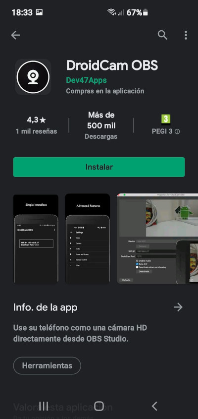 |
| DroidCam OBS listo para instalar |

Una vez instalada la ejecutamos y nos va a guiar en el proceso a seguir. En la imagen 4 nos da las gracias y nos indica que visitemos [dev47apps.com/obs](https://www.dev47apps.com/obs) para descargar el pluggin. Cuando pulsamos OK vemos la imagen 5, donde se inbdican las posibilidades de configuración de vídeo, que evidentemente tendremos que autorizar.

| Imagen 4 | Imagen 5 |
|:-:|:-:|
| 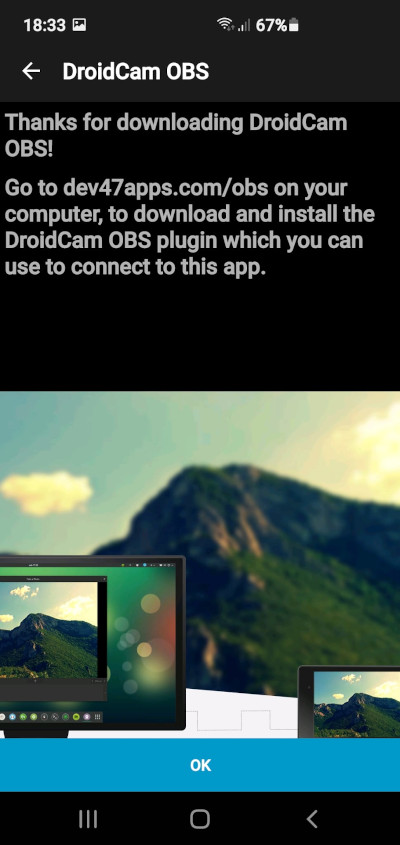 | 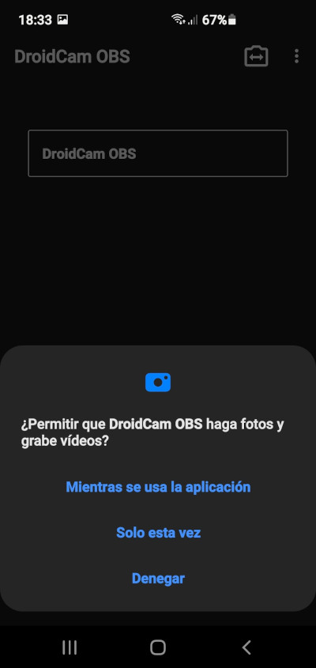 |
| DroidCam OBS: primera pantalla al ejecutar tras la instalación | DroidCam OBS: permisos de fotos y videos |

En la imagen 6 nos solicita permiso para grabar audio que concederemos y en la imagen 7 tenemos la App en ejecución indicando los datos para configurar la fuente en OBS.

| Imagen 6 | Imagen 7 |
|:-:|:-:|
| 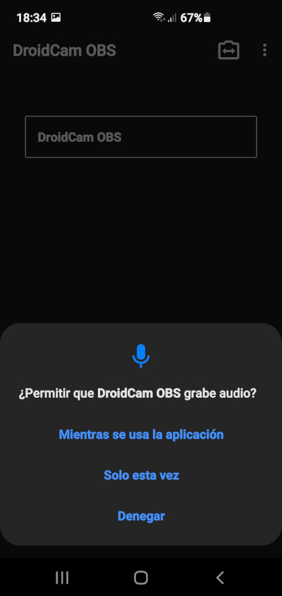 | 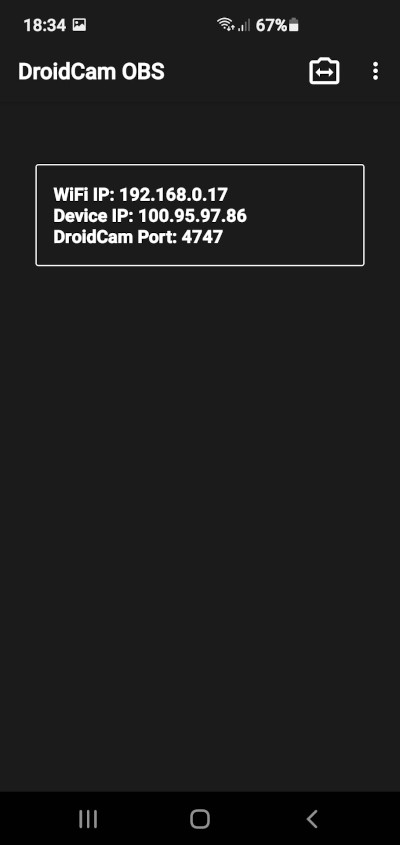 |
| DroidCam OBS: permisos de audio | DroidCam OBS: datos para configurar OBS |

El segundo paso es ir a [dev47apps.com/obs](https://www.dev47apps.com/obs) y descargar el pluggin para nuestro sistema operativo, en mi caso descargo droidcam_obs_1.2.0_linux.zip para Linux. Cuando se descomprime el archivo nos encontramos con un README-LINUX.txt que tiene el contenido que vemos en la imagen 8, en donde se nos indica como proceder para instalar el pluggin.

| Imagen 8 |
|:-:|
| 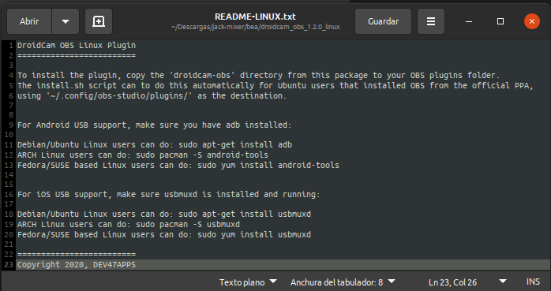 |
| README-LINUX de DroidCam OBS |

Una vez instalado el pluggin en nuestro sistema (según los casos puede ser necesario un reinicio del PC o bastará con reiniciar OBS) ya podemos arrancar OBS y observar que DroidCam OBS está disponible como fuente. Para ver esto vamos a crear una nueva escena con dos cámaras, una webcam y DroidCam OBS lo que nos va a permitir además comparar las calidades. En el video 1 observamos el proceso de creación de la escena con sus fuentes. Se aprovecha también para ver el proceso de copiar y pegar una fuente utilizada en otra escena.

| Video 1 |
|:-:|
| [Creación de una escena con webcam y DroidCam OBS](https://youtu.be/3K0pWRbNcj0) |

En el momento que configuramos la conexión y hacemos clic en el botón *Activate* se activará la cámara del móvil si tenemos la App activa.

DroidCam OBS nos permite conectar un teléfono y obtener audio y video de alta calidad como una fuente de cámara normal. Además se pueden conectar tantos dispositivos como se desee, bien a través de WiFi o a través de USB.

En el apartado de Preguntas frecuentes (FAQ) de su web tenemos mas información interesante.

Desde las propiedades de la fuente DroidCam OBS podemos activar y desactivar la fuente, habilitar el audio, permitir la aceleración hardware del driver y escoger la resolución con la que queremos visualizar el video. La única limitación que tiene DroidCam es que para resoluciones mayores nos pondrá una marca de agua (imagen 9) sobre la captura salvo que desbloqueemos todas las opciones pagando los 5,49€ que cuesta la App.

| Imagen 9 |
|:-:|
| 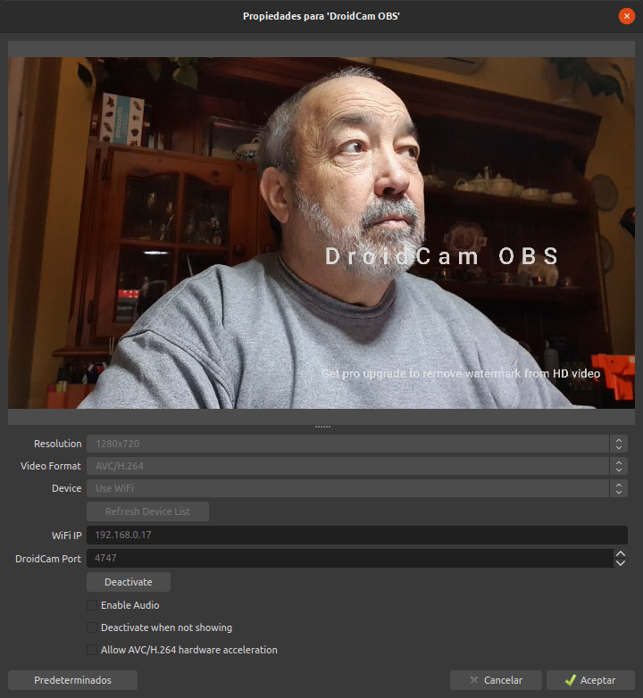 |
| Marca de agua de DroidCam OBS |

En el video 2 observamos como actuar en caso de poner el móvil en vertical para que la escena se vea correctamente. Además se establece una mayor resolución para DroidCam OBS.

| Video 2 |
|:-:|
| [Mayor resolución con DroidCam OBS y girar fuente](https://youtu.be/BLhA_mfDV8A) |

### Control remoto de DroidCam OBS
Este control nos va a permitir actuar sobre la App desde nuestro ordenador, aspecto bastante interesante para, por ejemplo, manipular la cámara que está enfocando a un montaje de un circuito sin necesidad de tener la cámara al alcance.

La App incluye un mando a distancia que en el caso de Linux podemos abrir desde un navegador como Chrome o Firefox sin mas que teclear en la barra de direcciones la dirección IP asignada seguida del puerto para DroidCam. En la imagen 10 vemos esto para mi caso en las dos situaciones mas comunes, cuando no tenemos activa la App en OBS y cuando si la tenemos.

| Imagen 10a | Imagen 10b |
|:-:|:-:|
| 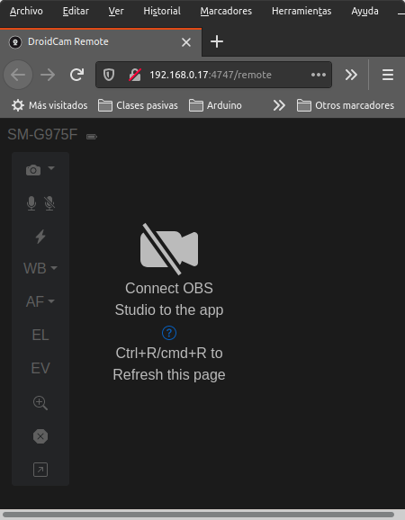 | 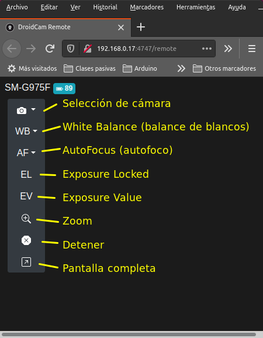 |
| Control remoto de DroidCam OBS sin activar DroidCam | Control remoto de DroidCam OBS con DroidCam activado |

En el video 3 vemos una escena en la que se está interactuando con el móvil desde el control remoto montado en una ventana de Firefox.

| Video 3 |
|:-:|
| [Control remoto con DroidCam OBS](https://youtu.be/PVH4OMohkFo) |

## Atajos en OBS
Configurar atajos en OBS es sencillo y lo podemos hacer accediendo a los mismos a través de ajustes. En la imagen 11 vemos la pantalla de configuración que se muestra al entrar en esta opción y que por ahora está vacía de atajos.

| Imagen 11 |
|:-:|
| 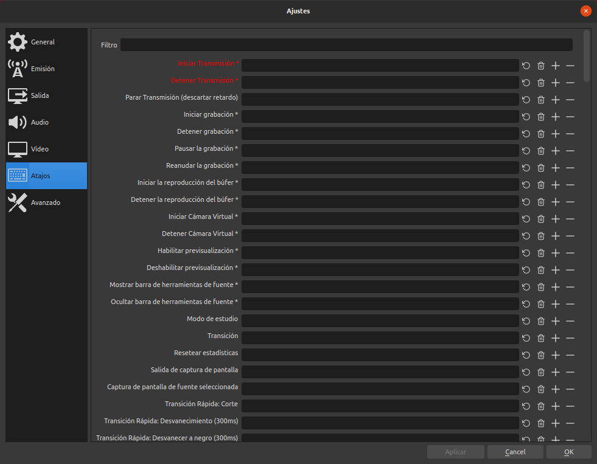 |
| Ventana de ajustes de atajos |

Se pueden configurar atajos de teclado para Mostrar y Ocultar las diferentes fuentes de vídeo de una escena previamente creada, como por ejemplo para mostrar y ocultar una webcam. En la imagen anterior se ven en rojo las dos primeras y esto indica que funcionan por parejas, es decir que la misma combinación de teclas Inicia o Detiene la transmisión si asignamos la misma combinación a ambos. Ademas cuando hacemos clic en alguna entrada podemos observar que actúa de forma inteligente al pulsar teclas en el teclado como Alt, Control, etc.

En la imagen 12 tenemos algunos ejemplos de configuración.

| Imagen 12 |
|:-:|
| 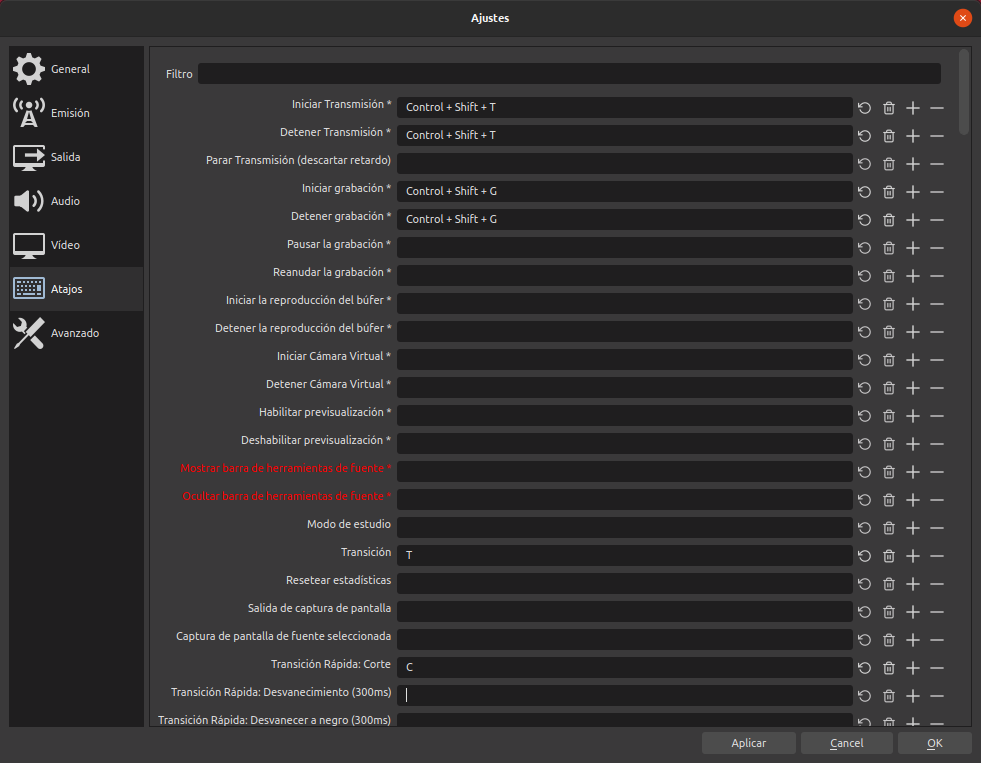 |
| Ejemplos de ajustes de atajos |

## Configuraciones básicas
Hago aquí un breve resumen de las distintas configuraciones mínimas necesarias para grabación y transmisión en distintas plataformas.

### Grabación
Cuando entramos en *Ajustes* y escogemos *Salida* (imagen 13) se nos muestran muy pocas opciones de configuración tanto de emisión como de grabación.

| Imagen 13 |
|:-:|
| 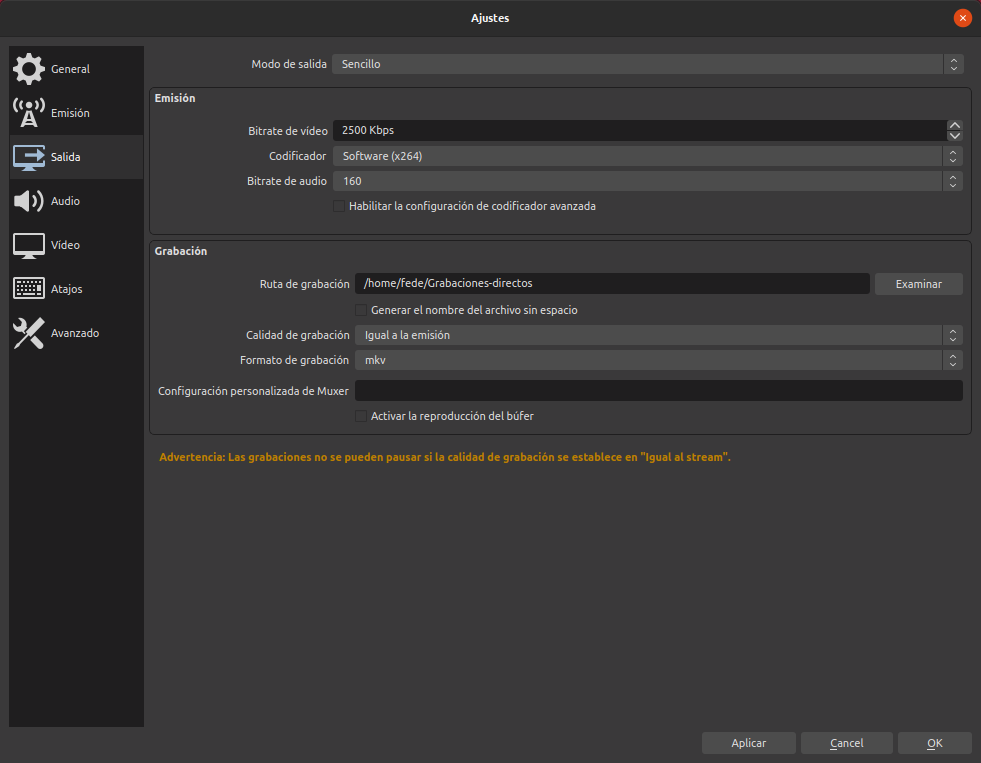 |
| Modo sencillo de ajustes de salida |

Cuando mostramos el modo *Avanzado* vemos la imagen 14 con muchas mas opciones de configuración disponibles. Nos centramos en la pestaña *Grabación*.

| Imagen 14 |
|:-:|
| 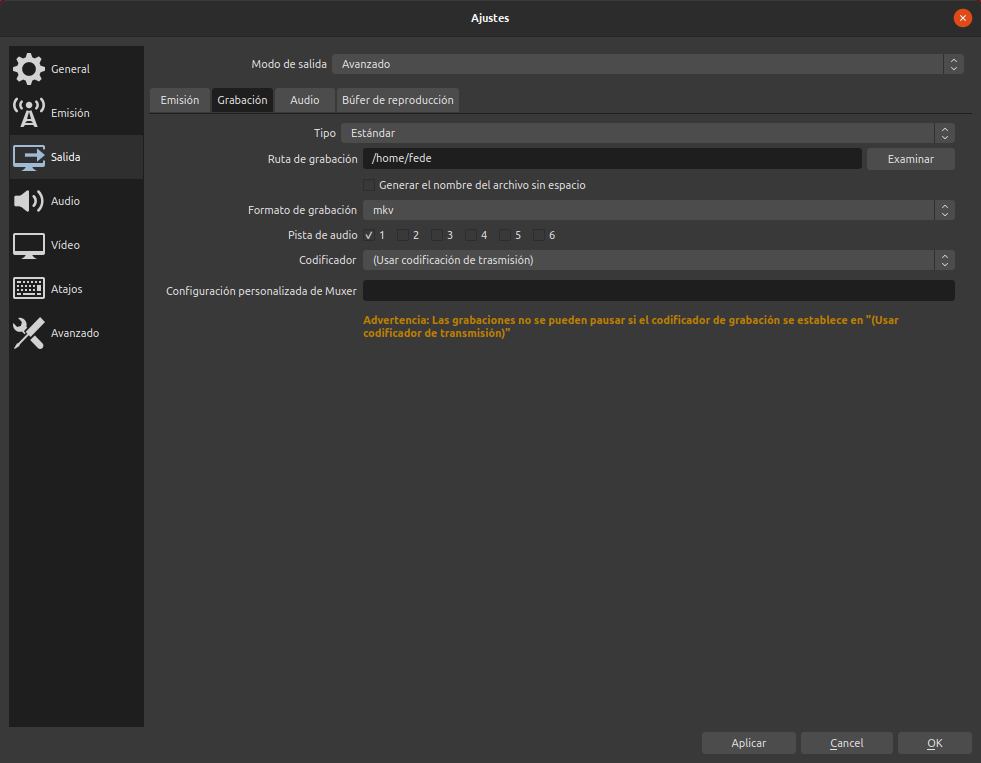 |
| Modo Avanzado de ajustes de Grabación |

En mi caso en codificador tengo dos opciones disponibles, el x264 que es un decodificador por software que se ejecuta desde el procesador del ordenador y el mecanismo de aceleración de hardware VAAPI que nos garantiza un alto rendimiento durante la grabación. En la imagen 15 vemos las opciones que tiene cuando es seleccionado este último. VAAPI utiliza una arquitectura modular que separa la interfaz del núcleo del programa.

| Imagen 15 |
|:-:|
| 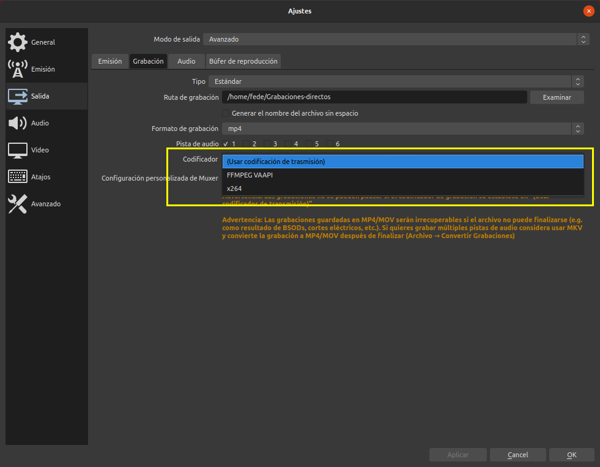 |
| Aceleración de hardware FFMPEG VAAPI |

En mi caso escojo como tipo la opción que vemos en la imagen 16 para disponer de aceleración de hardware.

| Imagen 16 |
|:-:|
| 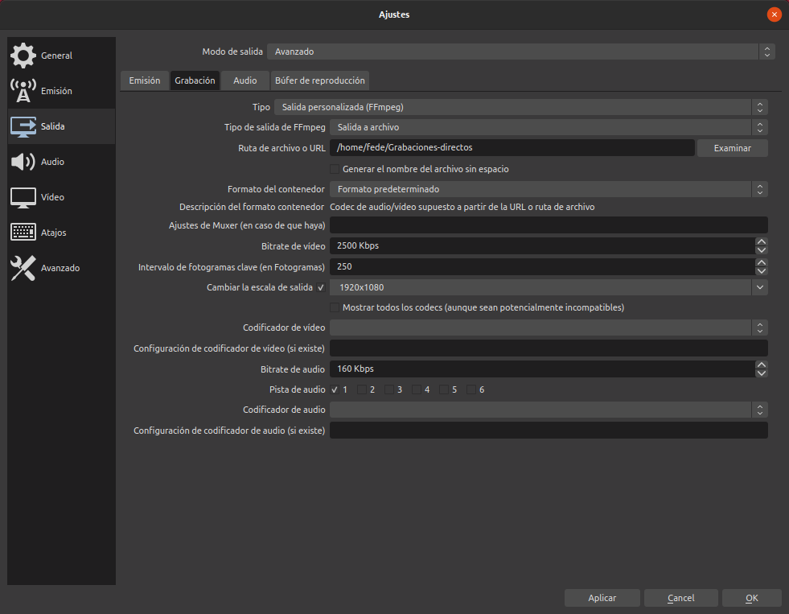 |
| Opciones de configuración de grabación |

Cuando estamos con estas tareas es muy conveniente que analicemos a través del *Monitor de sistema* el rendimiento de nuestro equipo para ver si presenta algún problema concreto.

En el video 4 vemos los cambios que se producen cuando iniciamos el proceso de grabación en concreto para el proceso OBS y vemos como afecta a nuestro equipo.

| Video 4 |
|:-:|
| [Monitor de sistema](https://youtu.be/yYeG1yWuQag) |

### Retransmisión en directo
En el apartado [Configuraciones](configuraciones.md) podemos encontrar todo lo necesario para configurar nuestra emisión en función de la calidad de nuestra conexión a internet.

* **Youtube**. Recordad que antes de hacer el primer directo hay que darse de alta (activar la retransmisión en directo) y el proceso tarda 24 horas antes de estar activo. El resto es de tareas es muy sencillo, basta con activar el servicio y copiar la clave de retransmisión en los ajuste de *Emisión*.
* **Facebook**. Nos vamos a transmitir video en directo. Probablemente nos pedirá permisos para usar la cámara y el micrófono del equipo en el que estemos. Seleccionamos la opción resaltada en la imagen 17 para acceder a la clave de retransmisión.

| Imagen 17 |
|:-:|
| 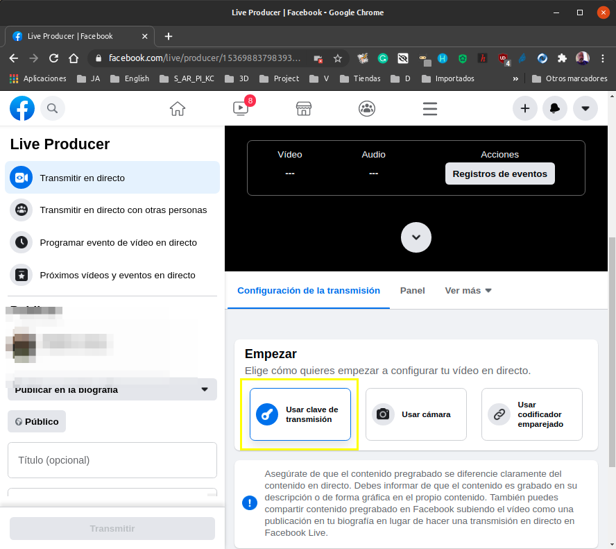 |
| Acceso a clave de retransmisión en Facebook |

En esa misma ventana si bajamos encontramos la URL del servidor y la clave de retransmisión que debemos poner en OBS.

* **Twitch**. En [Configuraciones](configuraciones.md) se describe como localizar la clave de retransmisión.

De forma muy similar existe la posibilidad de transmitir en otras plataformas.
