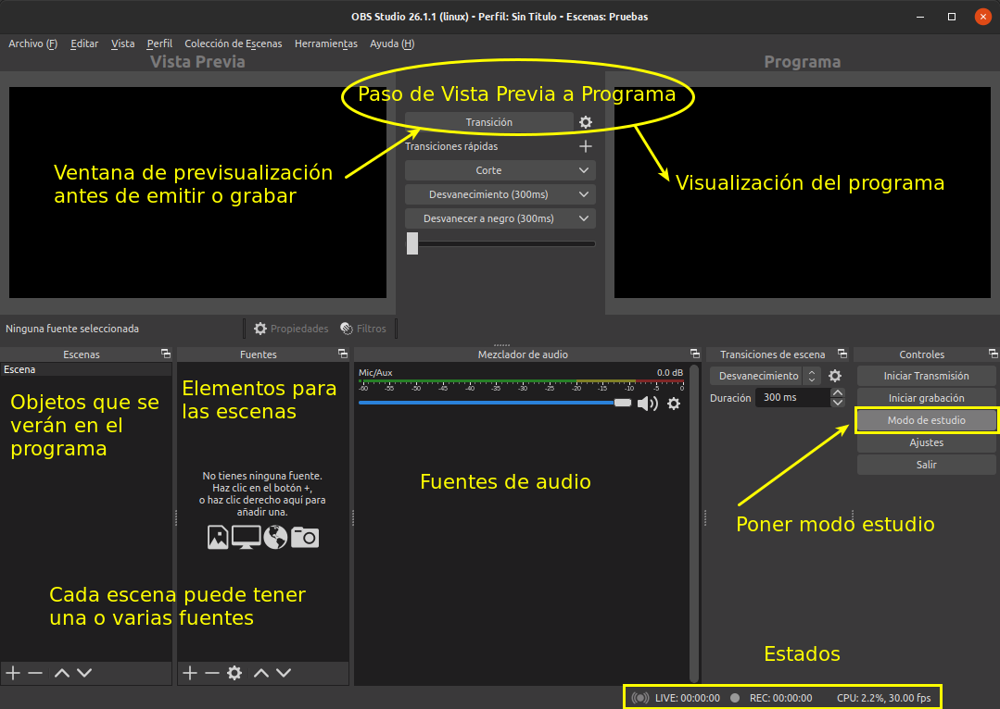
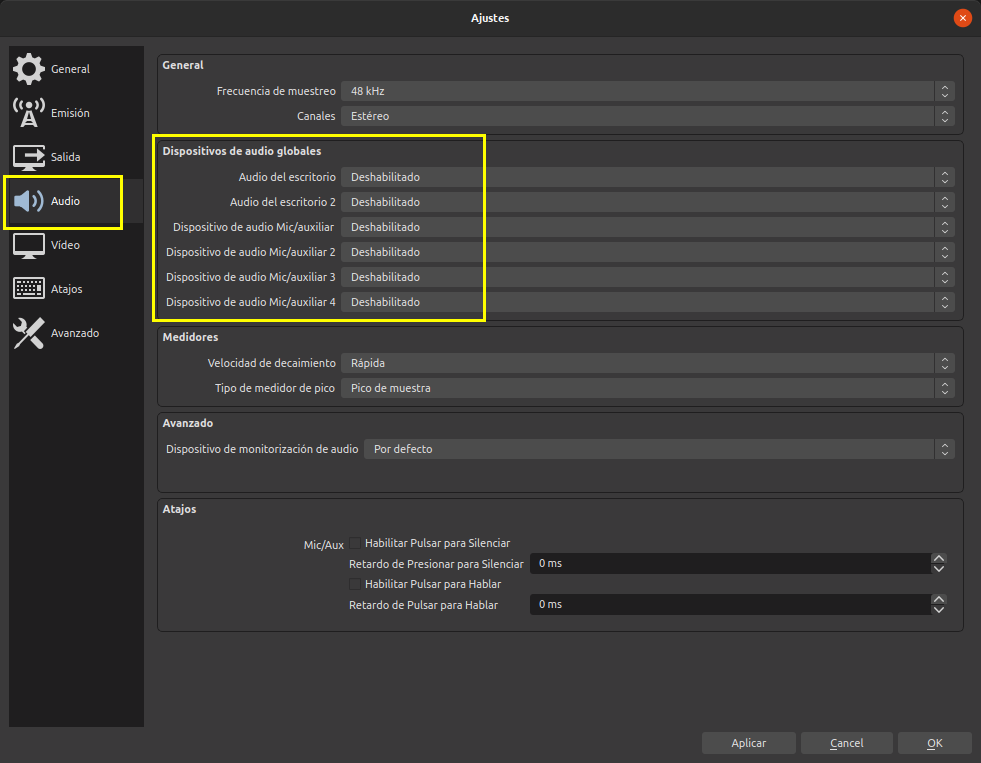
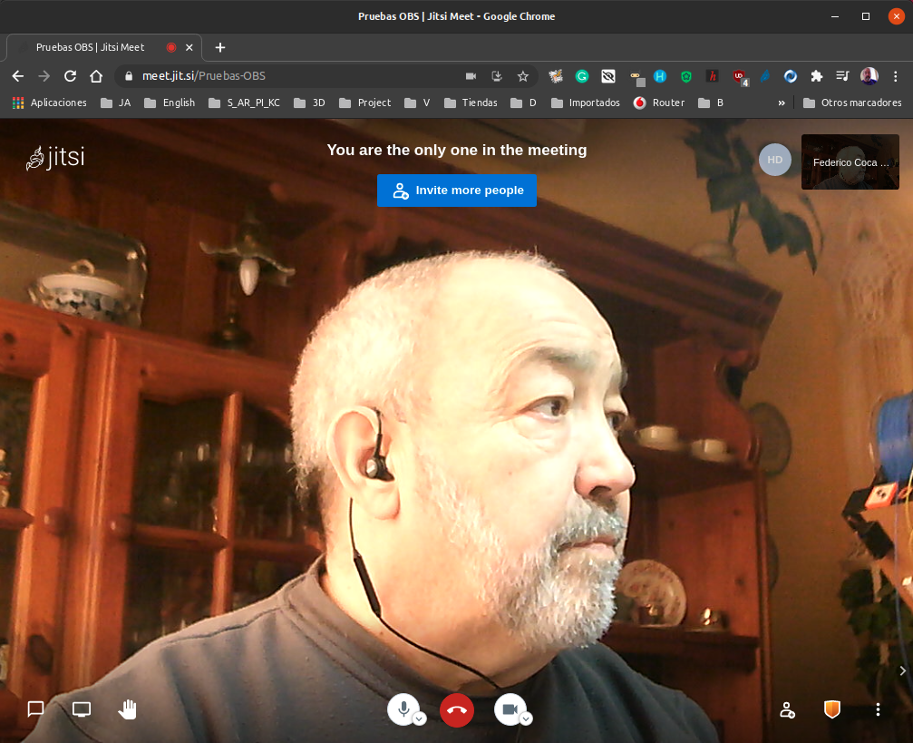

# Aprender por la práctica
Resulta conveniente antes de continuar con este apartado y analizar las posibilidades del programa, ver primero la sección [el IDE de OBS](../apartados/ide-obs.md) donde se describe el entorno del programa.

## Introducción

Para ir explicando las funcionalidades de OBS vamos a plantear un proyecto completo de transmisión en directo a través de Youtube que va a disponer de las siguientes partes:

* Una pantalla con imagen fija para inicio y final de la transmisión.

* Una introducción con webcam y micro en la que aparecerán textos en pantalla.
  
* Una pantalla con imagen fija indicando problemas de emisión
  
* Una presentación, la webcam y textos
  
* Emitir un video pregrabado
  
* Mostrar una página web

Antes de nada vamos a realizar una muy breve descripción del entorno o interfaz (se describe con mas detalle en el apartado correspondiente de estas notas) de OBS. Activamos para ello el modo estudio mediante el botón que tenemos disponible en la parte inferior derecha. El aspecto debe quedar como en la imagen 1, donde se dan breves descripciones de cada parte.

| Imagen 1 |
|:-:|
|  |
| Breve descripción gráfica del IDE de OBS |

Otra configuración básica que vamos a realizar está destinada a que podamos decidir cuando hay sonido en mi salida y cuando no lo hay, para conseguirlo vamos a ir a Ajustes bien mediante el botón justo debajo de *Modo de estudio* o bien mediante la entrada Configuración del menú Archivo. En la ventana que se nos abre (imagen 2) marcamos Audio y desactivamos todos los dispositivos.

| Imagen 2 |
|:-:|
|  |
| Desactivado del audio |

Antes de continuar con los apartados siguientes es muy conveniente tener claros los descritos en la sección Apartados específicos que se enlazan a continuación:

* [El IDE de OBS](../apartados/ide-obs.md)
* [Escenas](../apartados/escenas.md)
* [Perfiles](../apartados/perfiles.md)
* [Obtener clave de retransmisión](../apartados/clave.md)

## Capturar una reunión virtual
Para la explicación voy a utilizar una sala [Jitsi](https://jitsi.org/) en la que voy a estar solo, pero podría ser perfectamente una sala con mas asistentes o con otra plataforma de reuniones virtuales. En la imagen 3 tenemos una captura de la ventana de esta reunión.

| Imagen 3 |
|:-:|
|  |
| Ventana reunión Jitsi |

El siguiente paso es añadir una nueva escena a la que le incorporamos como fuente "Añadir una ventana (Xcomposite)" que ajustaremos de manera que ocupe la zona de visualización en vista previa de forma adecuada, es decir ajustar los límites para que se vea solamente lo que nos interesa, en este caso la imagen. En el vídeo 1 observamos el proceso.

| Vídeo 1 |
|:-:|
| [Añadir como fuente una ventana](https://youtu.be/58amd0qxwK8) |

## Configuración del audio
El problema que se nos va a plantear no se refiere al audio propio, sino al audio que tenemos que capturar de una fuente remota, por ejemplo de una presentación que está haciendo alguien o de una reunión virtual a través de Jitsi. Este audio hay que capturarlo en OBS para que se emita en directo. Para poder hacer esto necesitamos disponer de una mesa de mezclas de audio o mesa de sonido virtual.

En el caso de Linux la opción que voy a usar es [Jack](https://jackaudio.org/) que es una aplicación que toma la salida de audio de un programa y lo envía a otro, tal y como describe en la portada de la aplicación. En el apartado [Instalando Jack Mixer](../apartados/intall-jack.mixer.md) tenemos los detalles de instalación que he seguido para ubuntu 20.04 Focal Fosa.

seguir con la configuracion audio a partir minuto 12.40