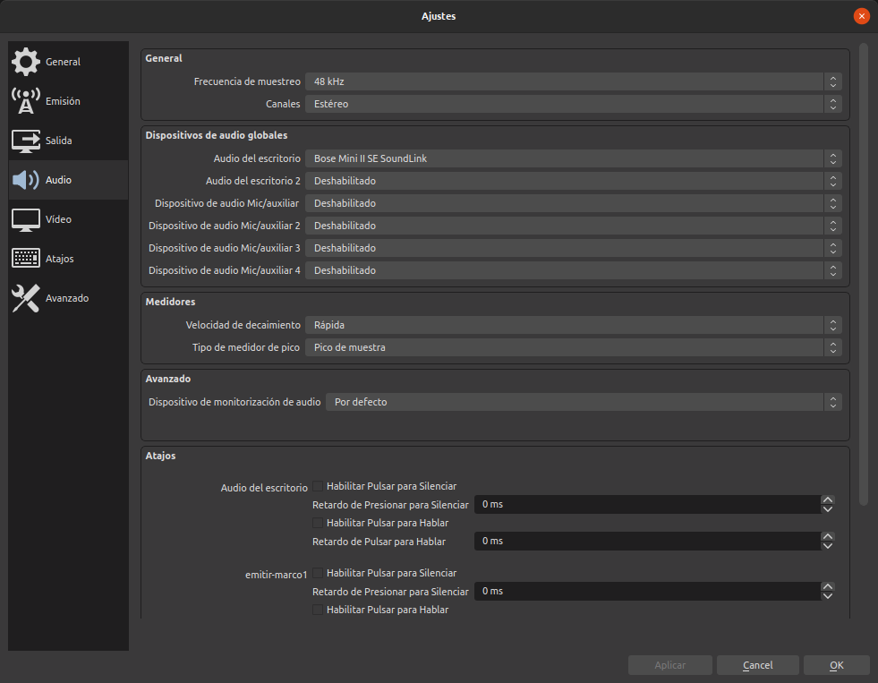
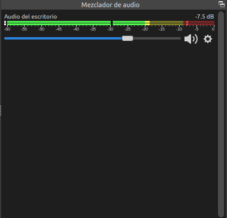

# Aprender por la práctica
Resulta conveniente antes de continuar con este apartado y analizar las posibilidades del programa, ver primero la sección [el IDE de OBS](../apartados/ide-obs.md) donde se describe el entorno del programa.

## Introducción

Para ir explicando las funcionalidades de OBS vamos a plantear un proyecto completo de transmisión en directo a través de Youtube que va a disponer de las siguientes partes:

* Una pantalla con imagen fija para inicio y final de la transmisión.

* Una introducción con webcam y micro en la que aparecerán textos en pantalla.
  
* Una pantalla con imagen fija indicando problemas de emisión
  
* Una presentación, la webcam y textos
  
* Emitir un video pregrabado
  
* Mostrar una página web

Antes de nada vamos a realizar una muy breve descripción del entorno o interfaz (se describe con mas detalle en el apartado correspondiente de estas notas) de OBS. Activamos para ello el modo estudio mediante el botón que tenemos disponible en la parte inferior derecha. El aspecto debe quedar como en la imagen 1, donde se dan breves descripciones de cada parte.

| Imagen 1 |
|:-:|
|  |
| Breve descripción gráfica del IDE de OBS |

Otra configuración básica que vamos a realizar está destinada a que podamos decidir cuando hay sonido en mi salida y cuando no lo hay, para conseguirlo vamos a ir a Ajustes bien mediante el botón justo debajo de *Modo de estudio* o bien mediante la entrada Configuración del menú Archivo. En la ventana que se nos abre (imagen 2) marcamos Audio y desactivamos todos los dispositivos.

| Imagen 2 |
|:-:|
|  |
| Desactivado del audio |

Antes de continuar con los apartados siguientes es muy conveniente tener claros los descritos en la sección Apartados específicos que se enlazan a continuación:

* [El IDE de OBS](../apartados/ide-obs.md)
* [Escenas](../apartados/escenas.md)
* [Perfiles](../apartados/perfiles.md)
* [Obtener clave de retransmisión](../apartados/clave.md)

## Capturar una reunión virtual
Para la explicación voy a utilizar una sala [Jitsi](https://jitsi.org/) en la que voy a estar solo, pero podría ser perfectamente una sala con mas asistentes o con otra plataforma de reuniones virtuales. En la imagen 3 tenemos una captura de la ventana de esta reunión.

| Imagen 3 |
|:-:|
|  |
| Ventana reunión Jitsi |

El siguiente paso es añadir una nueva escena a la que le incorporamos como fuente "Añadir una ventana (Xcomposite)" que ajustaremos de manera que ocupe la zona de visualización en vista previa de forma adecuada, es decir ajustar los límites para que se vea solamente lo que nos interesa, en este caso la imagen. En el vídeo 1 observamos el proceso.

| Vídeo 1 |
|:-:|
| [Añadir como fuente una ventana](https://youtu.be/58amd0qxwK8) |

## Configuración del audio
El problema que se nos va a plantear no se refiere al audio propio, sino al audio que tenemos que capturar de una fuente remota, por ejemplo de una presentación que está haciendo alguien o de una reunión virtual a través de Jitsi. Este audio hay que capturarlo en pOBS para que se emita en directo. Una forma profesional de poder hacer es disponer de una mesa de mezclas de audio o mesa de sonido virtual.

En el caso de Linux opciones como [Jack](https://jackaudio.org/), que es una aplicación que toma la salida de audio de un programa y lo envía a otro, tal y como describe en la portada de la aplicación. En el apartado [Instalando Jack Mixer](../apartados/intall-jack.mixer.md) tenemos los detalles de instalación para ubuntu 20.04 Focal Fosa.

Otro software interesante es [Carla](https://kx.studio/Applications:Carla), que integra Jack Mixer. Carla es un host modular de complementos de audio con todas las funciones, compatible con muchos controladores de audio y formatos de complementos. Tiene características interesantes como control de transporte, automatización de parámetros a través de MIDI y control remoto sobre OSC (del inglés, Open Sound Control) es un protocolo de comunicaciones que permite comunicar instrumentos de música, computadoras y otros dispositivos multimedia pensado para compartir información musical en tiempo real sobre una red. OSC aparece como reemplazo del MIDI, siendo muy superior en características y capacidades.

Toda la configuración del audio va a depender en gran medida de los dispositivos de audio que tengamos conectados en nuestro ordenador, siendo una tarea fundamental tener correctamente identificado cada cual. En mi caso voy a exponer un ejemplo que iré mostrando paso a paso.

### Audio interno o de escritorio
El audio interno o de escritorio es aquel que pasa por el ordenador, provenga de donde provenga.

El ordenador que utilizo para el ejemplo es un [Slimbook one](https://slimbook.es/) con tarjeta gráfica Intel UHD 620 4K con resoluciones soportadas HD, FullHD 1080, y UltraHD 4K y salida física de audio por HDMI en alta definición y conexión jack 3.5 de entrada y salida 2 en 1.

Como elemento de salida de audio utilizo un dispositivo Bose Mini II SoundLink Bluetooth que configuramos como "Audio de escritorio" y que pondremos en el mezclador de audio de OBS.

En la imagen 4 vemos la ventana de configuración de audio con este dispositivo configurado.

| Imagen 4 |
|:-:|
|  |
| Ajuste de audio para SoundLink |

En la imagen 5 tenemos el dispositivo configurado en el mezclador de OBS.

| Imagen 5 |
|:-:|
|  |
| SoundLink en el mezclador de audio |

En el vídeo 2 vemos el proceso de configuración del audio interno en OBS y como se activa en el mezclador al reproducir por ejemplo un video.

| Vídeo 2 |
|:-:|
| [Configuración de SoundLink como audio interno](https://youtu.be/G6vapnFD4W4) |

De esta forma SoundLink se convierte en mi dispositivo de salida de audio activo.

### Otras entrada de audio

En mi caso la webcam dispone de micrófono monoaural, por lo que podemos configurar este como entrada de audio. En el video 3 vemos los procedimientos seguidos para este dispositivo, de como añadirlo, silenciarlo, ocultarlo o mostrarlo y editar sus propiedades. En mi caso la webcam debe estar conectada y su micrófono no es el que usaré, así que lo mantendré en silencio y oculto para las escenas de cámara.

| Vídeo 3 |
|:-:|
| [Activar micro de entrada de webcam](https://youtu.be/xfl2Q61xzQw) |

